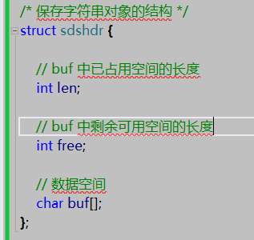
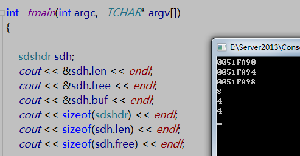
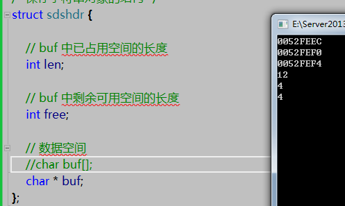
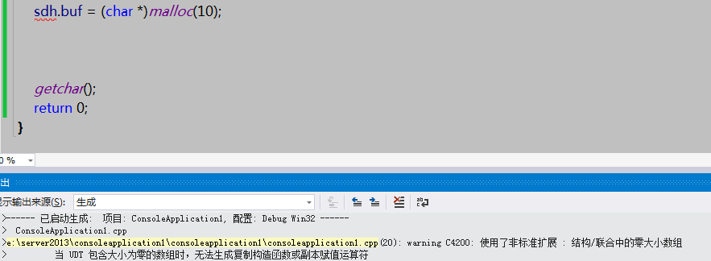
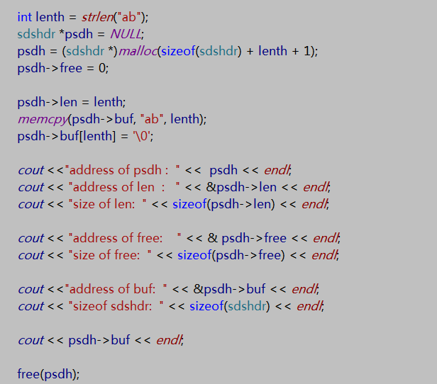
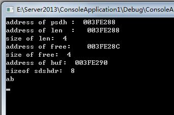
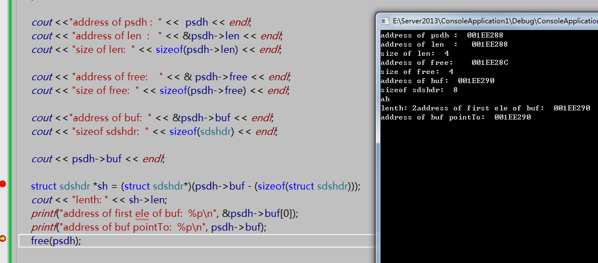

`redis`字符串可以实现通过地址偏移找到所在结构体的首地址，`struct sdshdr *sh = (void *)(s - (sizeof(struct sdshdr)))`

也就是通过buf地址可以找到sdshdr的地址，这个我一直不理解，写了代码测试下
<!--more-->

地址一次间隔4，结构体总大小为8，最后一个buf是空数组，没大小。之前自己一直错误的认为buf的大小按照char *开辟，这次打印出来大小为0
将结构体buf成员改为char *类型

这次大小变为12了，也就是char* 占用了四个字节
 现在回到最初的结构

 我尝试给buf开辟空间

编译是不允许的，这是个零大小的数组，但是buf[lenth]这种方式可以访问，只是数组越界罢了。
那就要一次给这个结构体开辟好空间，通过buf位移取出数据

结果
  
  
  
&buf和buf所指向的地址一个地址。因为它本身没有空间