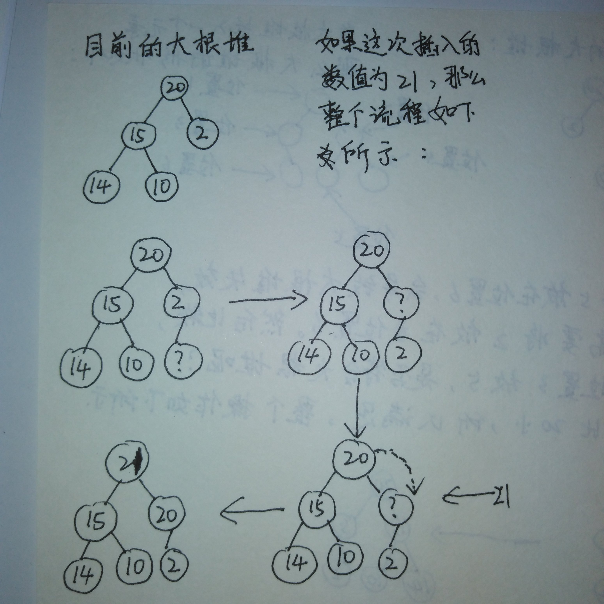
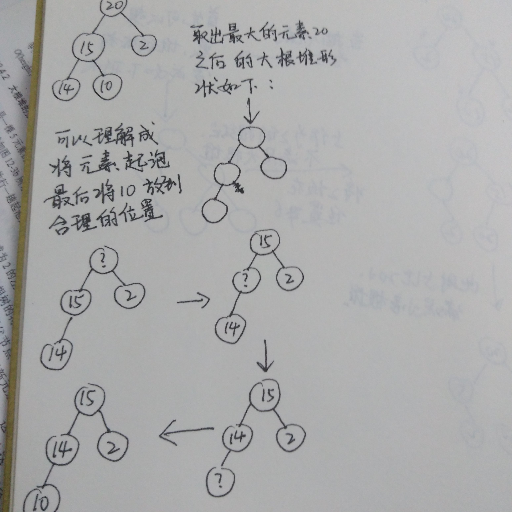
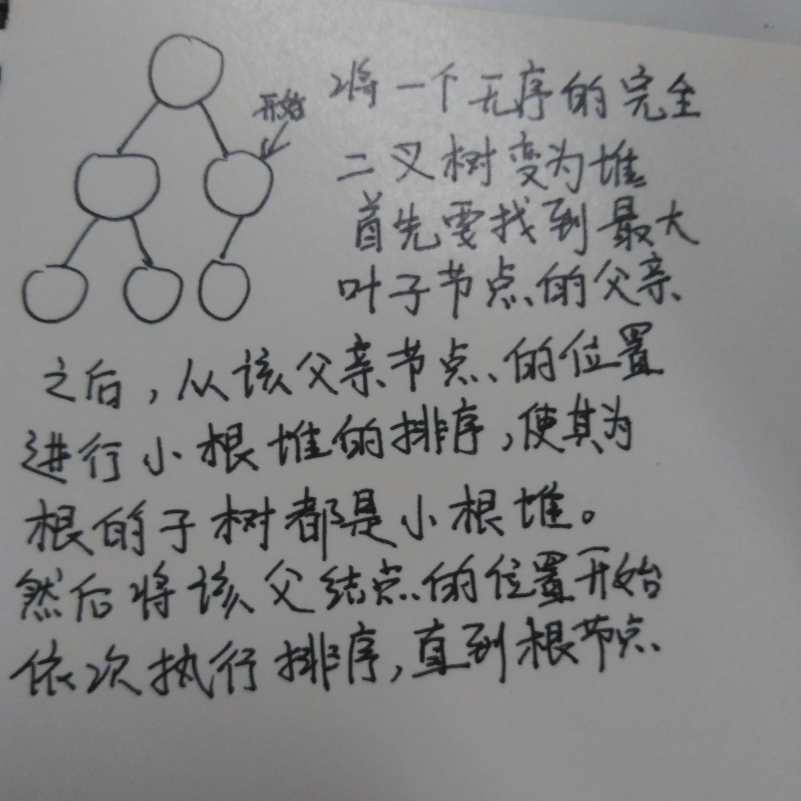
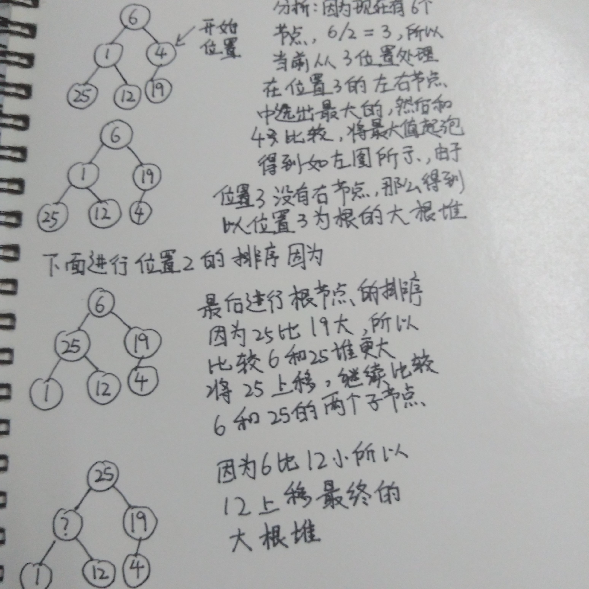

## 大根堆的定义：  
1 `大根堆是一个大根树`   
2 `大根堆是一个完全二叉树 ` 
所以大根堆用数组表示是连续的，不会出现空白字段。
## 对于大根堆的插入

对于大根堆的插入，可以在排序前确定大根堆的形状，可以确定元素5从位置6插入，那么比较元素5和位置3的元素2，

元素5比元素2大，将2下移。接着比较元素5和元素20，一次类推，直到找到元素5的合理位置。

接着看一下如果插入的元素是21，怎么进行排序。
<!--more-->

21比2大，所以将2下移，接着比较21和20，发现20比21小，20下移，最终21放到

根的位置。形成大根堆。
## 对于大根堆的删除

大根堆删除根元素，那么可以确定删除后的形状。可以理解成将最后一个叶子节点放在

合理位置，首先比较叶子节点元素10和根节点的两个孩子15和2，选出两个节点中最大的

元素15,15比10大，所以15进行气泡。放到根节点。然后15所在的位置2,变为不确定的问号。

由于14比10大，那么14起泡放到位置2，根据大根堆的形状，最后将10放到左节点

## 将一个无序的完全二叉树变为大根堆

将一个无序的完全二叉树变为大根堆(或者小根堆)，首先要找到最有一个叶子节点的父节点，

对该父节点为根节点的子树进行排序，生成一个大根堆(小根堆)。然后从节点位置依次

向前做同样的排序，将该节点到根节点的所有子树变为大根堆(小根堆)
举例子：

如上图所示，因为总共有6个节点，6/2 = 3,所以元素19的父节点是位置3的元素4，

将以4位根的子树变为大根堆。因为19比4大，所以19上移，4做叶子节点。依次类推，

从位置3到位置1的所有子树都按照这种逻辑处理，最终变成大根堆。

接着要处理位置2的子树，位置2的元素为1，两个节点为25和12，选最大的元素25，因为

25比1大，所以25进行上移，1变为叶子节点。这样位置2的子树就处理完了。

接着处理位置1，因为位置1的元素为6，两个节点分别为25和19，取最大节点元素25，

因为25比6大，所以25上移，而此时位置2还有两个节点元素1和元素12，需要比较元素6

和这两个节点中最大的，以确定大根堆。由于12比6大，所以12上移，6变为叶子节点。

最终用数组表示这个大根堆就是[25,12,19,1,6,4]
## 下面是代码实现和测试：

### 大根堆的类结构：
``` cpp
template <class T>
class maxHeap
{
public:
    maxHeap(void)
    {
        m_nHeapSize = 0;
            m_nHeapCapacity = 0;
            m_pHeapArray = NULL;
    }

    maxHeap(const maxHeap& tempHeap);
    maxHeap(T * heapArray, int arrayLen);

    ~maxHeap(){

        if(m_pHeapArray)
        {
            free(m_pHeapArray);
        }

        m_pHeapArray = NULL;
        m_nHeapSize = 0;
        m_nHeapCapacity = 0;
    }

    //插入节点
    void insertNode(const T& t);
   //pop堆顶元素
    const T& popRoot();
    //打印自己的堆元素，用数组表示法输出
    void printHeap();
    //将一个无序的数组变为大根堆
    void createMaxHeap(T * heapArray, int arrayLen);
    //销毁自己的堆元素
    void deallocMaxHeap();
    //打印数组的元素
    void printHeap(T * heapArray, int arrayLen);

private:
    //堆的数组元素，连续区间首地址
    T*  m_pHeapArray;
    //当前使用的大小
    int m_nHeapSize;
    //堆的容量，实际开辟的大小
    int m_nHeapCapacity;
};
```
### 两个构造函数：
``` cpp
template <class T>
maxHeap<T>::maxHeap(const maxHeap  &tempHeap){
    m_nHeapSize = tempHeap.m_nHeapSize;
    m_pHeapArray = malloc(sizeof(class maxHeap) *m_nHeapSize);
    m_nHeapCapacity = m_nHeapSize;
}

template <class T>
maxHeap<T>::maxHeap(T * heapArray, int arrayLen)
{
    m_nHeapSize = arrayLen;
    m_pHeapArray = malloc(sizeof(class maxHeap) * m_nHeapSize);
    m_nHeapCapacity = arrayLen;
}
```
### 插入节点
``` cpp
template <class T>
void maxHeap<T>::insertNode(const T& node)
{
    m_nHeapSize ++;
    if(m_nHeapSize >= m_nHeapCapacity)
    {
        m_pHeapArray = (T *)realloc(m_pHeapArray, sizeof(T) * m_nHeapSize *2);
    }

    m_nHeapCapacity = m_nHeapSize*2;

    //当前节点所在位置
    int currentIndex = m_nHeapSize;
    //该节点父节点所在位置
    int parentIndex = currentIndex/2;
    //当前节点为根节点，跳出循环直接插入即可
    while(currentIndex != 1)
    {
        //父节点元素小于该node，因为是大根堆，所以父节点下移
        if(m_pHeapArray[parentIndex -1] < node)
        {
            //父节点数据下移
            m_pHeapArray[currentIndex - 1] = m_pHeapArray[parentIndex -1];
            //更新当前节点位置，当前比较位置上移
            currentIndex = currentIndex/2;
            //父节点位置同样上移
            parentIndex =  parentIndex/2;
        }
        else
        {
            break;
        }
    }
    //因为节点数是从1开始的，所以节点数-1表示数组中的位置
    m_pHeapArray[currentIndex -1] = node;

    
}
```
### 打印元素
``` cpp
template <class T>
void maxHeap<T>::printHeap()
{
    cout <<"current max heap array is :" << endl;
    for(int i = 0; i < m_nHeapSize; i++)
    {
        cout << m_pHeapArray[i] << " ";
    }
    cout << endl;
}

template <class T>
void maxHeap<T>::printHeap(T * heapArray, int arrayLen)
{
    cout <<"current max heap array is :" << endl;
    for(int i = 0; i < arrayLen; i++)
    {
        cout << heapArray[i] << " ";
    }
    cout << endl;
}
```

### pop堆顶的元素，取出最大值
``` cpp
template <class T>
const T& maxHeap<T>::popRoot()
{
    //先取出最后的叶子节点
    const T& lastEle = m_pHeapArray[m_nHeapSize-1];
    
    //更新heapsize
    m_nHeapSize --;

    //删除时需要从根节点开始，找到最大值起泡
    int currentIndex= 1;
    //当前节点的做孩子
    int leftChild = currentIndex *2;
    //当前节点的孩子节点超过堆大小，说明该节点为叶子节点
    while(leftChild <= m_nHeapSize)
    {
        int bigChild = leftChild;
        //取出两个孩子中大的孩子，然后将大的孩子节点数据上移
        if(leftChild < m_nHeapSize && m_pHeapArray[leftChild-1] < m_pHeapArray[leftChild])
        {
            //更新大孩子节点为右节点
            bigChild = leftChild +1;
        }
        //比较两个节点中大的孩子节点和取出的最后叶子节点，那个数值大
        //如果最后的叶子节点数值大，那么可以跳出循环,因为找到了lastEle的合理位置
        //剩余的树也是大根堆
        if(m_pHeapArray[bigChild -1] <= lastEle)
        {
            break;
        }
        //大节点数据上移
        m_pHeapArray[currentIndex -1] = m_pHeapArray[bigChild-1];
        //更新插入位置为当前大节点位置
        currentIndex = bigChild;
        leftChild = currentIndex *2;
    }
    
    m_pHeapArray[currentIndex-1] = lastEle;

    return lastEle;
}
```

将一个无序的数组元素，变为大根堆
``` cpp
template <class T>
void maxHeap<T>::createMaxHeap(T * heapArray, int arrayLen)
{
    //判断异常
    if(arrayLen <= 0 || heapArray == NULL)
    {
        return ;
    }
    
    //从最后一个叶子节点的父节点开始，依次从该位置到根节点
    //例如该位置为3，那么位置3，位置2，位置1的根节点的子树依次处理为大根堆

    int currentIndex = arrayLen;
    //父节点位置
    int beginIndex =  currentIndex/2;
    //依次处理，形成子树大根堆
    for(int i = beginIndex; i > 0;  i--)
    {
        int rootEle = heapArray[i-1];

        int curNode = i;
        int leftChild = i *2;
        while(leftChild <= arrayLen)
        {
            int bigChild = leftChild;

            int rootElePrint =  heapArray[leftChild-1];
            int rightElePrint = heapArray[leftChild+1 -1] ;

            if(leftChild +1 <= arrayLen && heapArray[leftChild+1 -1] > heapArray[leftChild-1])
            {
                bigChild = leftChild +1;
            }

            if(heapArray[bigChild -1] <= rootEle )
            {
                break;
            }

        
             
            heapArray[curNode -1] = heapArray[bigChild -1];
            curNode = bigChild;
            leftChild = curNode *2;
        }
        
        heapArray[curNode -1] = rootEle;
        
 　}   
}
```
源代码下载地址： [http://download.csdn.net/detail/secondtonone1/9575112](http://download.csdn.net/detail/secondtonone1/9575112)