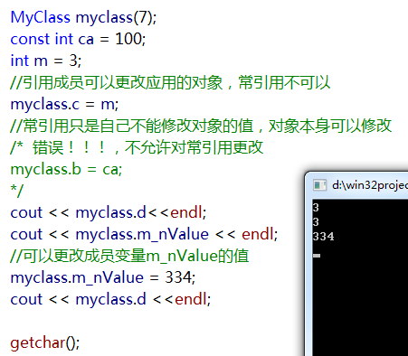

## 一. C++`类的引用成员`，`类的常量成员`，`类的static成员`的初始化方式
类的引用成员和常量成员初始化放在初始化列表里，因为初始化只有一次，需要在构造函数之前进行初始化，写在类的构造函数会出错。类的static变量要放在类声明的外边定义，因为static变量属于整个类，而不是类对象，所以不能放在类的构造函数里。  
举个例子：  
一个类中既有常量成员也有引用成员
``` cpp
class MyClass
{
public:
    MyClass(int value):a(1),b(a), m_nValue(value),c(m_nValue),d(m_nValue){}
public:
    const  int  a;
    const  int & b;
    int & c;
    const int &d;
    int m_nValue;
    static tms s;
    static double f;
};

tms MyClass::s;
double MyClass::f = 0.33;
```
<!-- more -->
类的引用成员必须在类的初始化列表初始化，而且必须初始化，否则编译出错。类的static成员需要在类外定义，否则使用时会出错。  
类的常引用和引用的区别是  

1. `可以通过引用修改引用对象的数值，不可以通过常引用修改引用对象的数值`

2. `引用可以更改引用的对象，从而引用另一个变量，常引用是不能更改引用的对象的。`

3. `常引用可以引用非常量(变量)和常量以及右值，引用只能引用变量。`

4. `当常引用引用变量的时候，可以修改变量值，常引用的数值会随着改变，但是不能直接修改常引用。`

下面是测试  


## 二 类的常对象调用的接口必须都为常函数，很多人写法不注意编译会报错。
代码示例为自己的一个项目，msgStream为常引用，那么他内部的列表返回的迭代器需要用const_iterator
``` cpp
MsgStream( const MsgStream & msgStream)
{
    m_nCount = msgStream.m_nCount;

    msgStream.m_listConMsg.begin();

    for(std::list<ConMsgNode>::const_iterator  msgIter = msgStream.m_listConMsg.begin(); 
        msgIter != msgStream.m_listConMsg.end();  msgIter++ )
    {
        m_listConMsg.push_back(*msgIter);
    }
        
}
```
msgStream 这个常引用也只能调用常量成员函数， 函数体后有const声明的函数

## 三析构函数的顺序，构造函数的顺序

1. `当类子类中包含其他的类，构造的顺序是先构造基类对象，然后构造子类包含的类对象，最后构造子类对象。`

2. `当基类中包含其他的类，构造的顺序是先构造基类中包含的类对象，然后构造基类对象，最后构造子类对象。`

3. `当类子类中包含其他的类，析构的顺序是先构子类对象，然后析构子类包含的其他类对象，最后析构基类。`

4. `当基类中包含其他的类，析构的顺序是先析构子类对象，然后析构基类对象，最后析构基类中其他对象。`
``` cpp
class c
{
public:
    c(){ printf("c\n"); }
protected:
private:
};

class b 
{
public:
    b(){ printf("b\n");}
protected:
    c C;
private:
};

class a : public b
{
public:
    a(){ printf("a\n"); }
protected:
private:
};

int main()
{
    a A;
    getchar();
}
```

结果：


``` cpp
class c
{
public:
    c(){ printf("c\n"); }
protected:
private:
};

class b 
{
public:
    b(){ printf("b\n");}
protected:
private:
};

class a : public b
{
public:
    a(){ printf("a\n"); }
protected:
    c C;
private:
};

int main()
{
    a A;
    getchar();
}
```
结果：


``` cpp
class c
{
public:
    c(){}
    ~c(){ printf("c\n"); }
protected:
private:
};

class b 
{
public:
    b(){}
    ~b(){ printf("b\n");}
protected:
private:
};

class a : public b
{
public:
    a(){}
    ~a(){ printf("a\n"); }
protected:
    c C;
private:
};

int main()
{
    a A;
    return 0;
}
```
结果：


## 四 list 直接赋值给另外一个list，并不会导致list元素的深拷贝，两个list中的元素是同一份数据