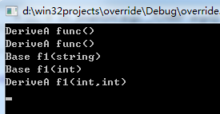
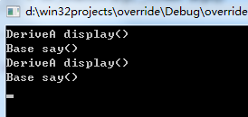
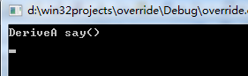
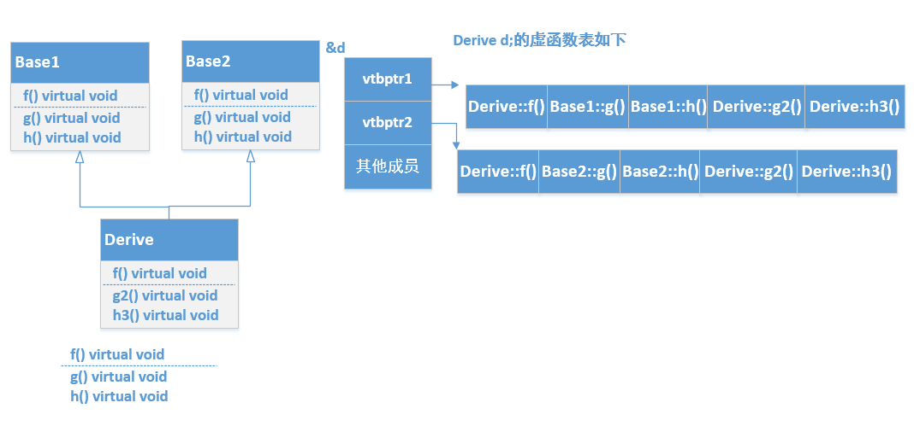
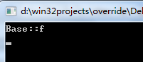

最近在自学python，看到继承和类，就顺便复习了C++的类和继承等方面的知识。  
先看Base基类  
``` c++
class Base {

private:

    virtual void display() { cout<<"Base display()"<<endl; }

    void say(){ cout<<"Base say()"<<endl; }

public:

    virtual void func(){cout << "Base func()" << endl; }
    void exec(){ display(); say(); }

    void f1(string a) { cout<<"Base f1(string)"<<endl; }

    void f1(int a) { cout<<"Base f1(int)"<<endl; }   //overload

};
```
<!-- more -->
Base类中定义私有的虚函数display， 普通成员函数say，公共的虚函数func， 普通的成员函数exec，重载了f1函数。下面是DeriveA类，继承于Base类
``` Cpp
class DeriveA:public Base{

public:

    void display() { cout<<"DeriveA display()"<<endl; }         //override

    void f1(int a,int b) { cout<<"DeriveA f1(int,int)"<<endl; }   //redefining

    void say() { cout<<"DeriveA say()"<<endl; }   //redefining

    virtual void func(){cout << "DeriveA func()" << endl; }

};
```
DeriveA类继承了Base类，重写(覆盖)了虚函数display和func，并且将display权限修改为public。重定义了f1函数和say函数，但是修改了f1的参数列表。下面是基础的几个测试 
```cpp
	DeriveA a;
	Base *b=&a;
    b->func();
    a.func();
    b->f1("abc");
    b->f1(3);
    a.f1(3,5);    
```
输出结果:

func函数在Base类中为虚函数，DeriveA继承Base后，根据多态机制实现了动态调用。所谓多态机制就是用基类指针指向子类对象，基类指针调用虚函数func，会动态调用实际的子类对象的func函数。由于display函数在Base类中为虚函数，所以不可以通过b->display()调用。由于DeriveA重新定义(redefining)了f1函数，f1函数参数类型修改了，所以只能使用a.f1(int,int)这种调用，而采用a.f1(string)或者采用a.f1(int)这种调用都会出错，编译阶段就会出错。因为DeriveA类对f1重新定义了，基类的f1函数不可通过对象直接调用。同样的道理对于基类指针或对象，无论基类指针指向子类还是基类对象，调用f1只能调用基类定义的两个f1(int)， f1(string)两个函数，  
如果采用b->f1(3,5)，编译器在编译阶段就会提出错误。想实现子类对象调用基类的函数可在函数体内加上作用于Base::函数名(参数，...)
DeriveA类修改f1函数，先调用基类的f1在调用自己的f1
``` cpp
class DeriveA:public Base{

public:

    void display() { cout<<"DeriveA display()"<<endl; }   //override

    void f1(int a,int b) { 
        Base::f1(2);
        Base::f1("test");
        cout<<"DeriveA f1(int,int)"<<endl; }   //redefining

    void say() { cout<<"DeriveA say()"<<endl; }   //redefining

    virtual void func(){
        
        cout << "DeriveA func()" << endl; }

}; 
```
  
打印输出a.f1(3,5);  
结果如下：

先调用了基类的两个f1函数，之后调用DeriveA的f1函数
下面调用如下函数
b->exec();  
a.exec();  
结果如下：
  
为什么两个结果一样呢？  
先看b->exec()；由于b是Base类型变量，那么调用的Base类的exec函数，exec函数内部调用Base类的display()和say() 函数。由于b为指向DeriveA类的基类指针，根据多态机制，调用Base类的display()函数时，会动态调用DeriveA类的display()函数。调用Base类的say()函数时，由于say()函数不是虚函数，所以不触发多态机制。  
因此b->exec()函数的结果为调用DeriveA的display，调用Base的say函数。由于DeriveA类继承于Base类，但是没有实现自己的exec()函数，即没有实现重定义，那么当执行a.exec()时，调用的时Base类的exec()函数，原理和上边一样，调用Base类中的display()函数和say()函数，由于display()函数为虚函数，a为DeriveA类对象，调用基类的虚函数display()，根据多态机制，实际调用的是DeriveA类的display()函数。  
执行下边代码  
a.say()  
结果如下：

下面修改DeriveA类的内容，在DeriveA类内部实现自己的exec()函数  
```cpp
class DeriveA:public Base{

public:

    void exec(){ display(); say(); }

    void display() { cout<<"DeriveA display()"<<endl; }   //override

    void f1(int a,int b) { 
        cout<<"DeriveA f1(int,int)"<<endl; }   //redefining

    void say() { cout<<"DeriveA say()"<<endl; }   //redefining

    virtual void func(){
        
        cout << "DeriveA func()" << endl; }

};
```
执行下边代码，  
b->exec()；  
a.exec():  
结果如下:  

因为DeriveA类重定义了exec函数，那么a.exec()函数调用的是DeriveA类的exec()函数，从而调用的都是DeriveA类的display()和say()函数。  
## 继承类和基类成员函数调用规则总结：  
DeriveA a;  
  Base *b=&a;  
1.  `基类指针指向子类对象，该指针调用某个成员函数，先考虑该函数是否为虚函数，如果为虚函数，且子类有覆盖(重写)，会触发多态机制，动态调用子类的重写函数：
如 b->func()， 输出为DeriveA func()`

2.  `基类指针指向子类对象，该指针调用某个成员函数，先考虑该函数是否为虚函数，如果为虚函数，子类没有覆盖(没有重写)，不会触发多态机制，调用基类的虚函数：`

3.  `基类指针指向子类对象，该指针调用某个成员函数，如果该函数不为虚函数，无论该函数是否被子类重定义(redefined)，只调用基类的该成员函数。如DeriveA类内部不实现exec()函数，那么b->exec()调用的是Base类的exec()函数。`

4.  `在第3条基础上，基类有成员函数exec()， 子类没有成员函数exec()，在基类的exec() 内部调用虚函数display()， 且子类覆盖了display()函数，那么根据多态机制，调用子类的display()。如果display()虚函数没有被重写，则调用基类的display()函数，同第2条。如果exec()内部调用普通函数say()， 无论子类是否重定义say()，都会调用基类的say()函数，同3`

5.  `Base类中实现exec()函数，而子类DeriveA类内部不实现exec()函数，DeriveA类对象调用exec()函数，实际调用的为Base类内部的exec()函数。如果exec()内部调用虚函数或者普通成员函数，情况如同第4条。`

6.  `Base类中实现exec()函数，而子类DeriveA类重定义exec()函数，那么DeriveA类对象调用的是DeriveA类的exec()函数。如果exec()函数内部调用DeriveA类的其他成员函数，那么调用的都是DeriveA类的成员函数。`

7.  `子类重定义了基类的成员函数，那么子类对象调用该成员函数，要根据子类重定义的形参列表。如a.f1(3,5);`  
## 虚函数使用和定义规则:  

   
1. `非类的成员函数不能定义为虚函数，类的成员函数中静态成员函数和构造函数也不能定义为虚函数，但可以将析构函数定义为虚函数。实际上，优秀的程序员常常把基类的析构函数定义为虚函数。`因为，将基类的析构函数定义为虚函数后，当利用delete删除一个指向派生类定义的对象指针时，系统会调用相应的类的析构函数。而不将析构函数定义为虚函数时，只调用基类的析构函数。

2.  `只需要在声明函数的类体中使用关键字“virtual”将函数声明为虚函数，而定义函数时不需要使用关键字“virtual”。`

3.  `如果声明了某个成员函数为虚函数，则在该类中不能出现和这个成员函数同名并且返回值、参数个数、参数类型都相同的非虚函数。在以该类为基类的派生类中，也不能出现这种非虚的同名同返回值同参数个数同参数类型函数。`

## 类的静态函数和构造函数不可以定义为虚函数:  

1. 静态函数的目的是通过类名+函数名访问类的static变量，或者通过对象调用staic函数实现对static成员变量的读写，要求内存中只有一份数据。而虚函数在子类中重写，并且通过多态机制实现动态调用，在内存中需要保存不同的重写版本。

2. 构造函数的作用是构造对象，而虚函数的调用是在对象已经构造完成，并且通过调用时动态绑定。动态绑定是因为每个类对象内部都有一个指针，指向虚函数表的首地址。而且虚函数，类的成员函数，static成员函数都不是存储在类对象中，而是在内存中只保留一份。
## 知其然、知其所以然（虚函数表原理）：
虚函数存储在虚函数表中，每个类对象都包含一个指向该虚函数表首地址的指针。定义Baseclass类  
```cpp
class Baseclass { 

public: 
    Baseclass():a(1024){}
    virtual void f() { cout << "Base::f" << endl; } 
    virtual void g() { cout << "Base::g" << endl; } 
    virtual void h() { cout << "Base::h" << endl; } 
    int a;
}; 
```
从虚函数表中依次取出函数执行：  
```cpp
	Baseclass b; 

    cout <<"类对象大小" <<  sizeof(b) << endl;

    int * p = (int *)(&b) ;
    cout << "指向虚函数表的指针的地址"<< p << endl;
    cout <<"成员a地址"<< p+1 << endl;
    cout <<"成员a的数值" << *(p + 1) << endl;
    cout << "虚函数表首地址" <<(int *)(*p)  << endl;

    Func pFun =(Func) *(int *)(*p);
    pFun();
 
     pFun =(Func) *((int *)(*p) + 1);
    pFun();

     pFun =(Func) *((int *)(*p) + 2);
    pFun();
```
输出结果如下:  

可见类对象大小为8字节，4字节正好是指向虚函数表指针的大小。剩余4字节为成员变量a的大小。画个图示意虚函数表结构：  

p指向的就是类对象的首地址，同时也是虚函数表指针(指向虚函数表的指针)的地址，*p指向虚函数表，由于指针是4字节，(int *)(*p)虚函数表首地址，也是第一个函数指针的地址。  
Derive类继承于Base类，但是没有覆盖(重写)Base类的虚函数，Derive d; 的虚函数表如下：  

Derive类继承于Base类，并且覆盖(重写)Base类的虚函数，Derive d; 的虚函数表如下：  

可以看到d的虚函数表中第一个单元为Derive::f()，覆盖了原有的Base::f()。  
Derive d;  
Base * p = &d;  
p指向d的首地址，其实就是d的虚函数表指针的地址，p->f()实际会调用虚函数表中的Derive::f()，从而实现多态。  
多重继承结构如下：

虚函数表原理后可以篡改部分程序功能，其实很多外挂就是钩子函数回调注入的。  
```cpp
class Baseclass { 

public: 
    Baseclass():a(1024){}
private:
    virtual void f() { cout << "Base::f" << endl; } 

    virtual void g() { cout << "Base::g" << endl; } 

    virtual void h() { cout << "Base::h" << endl; } 

    int a;
}; 

class Deriveclass:public Baseclass{
public:
    Deriveclass():Baseclass(){}

};
```
由于 Baseclass内部的虚函数是私有的，所以Deriveclass类变量是不能直接访问这些函数的。但是可以通过虚函数寻址，并且通过回调函数方式调用。  
```cpp
Deriveclass d;
    Func pFunc = (Func)*((int *)(*(int *)(&d)));
    pFunc();
```
结果如下：  

## C++类对象的大小为多大？
`一个类中，虚函数、成员函数（包括静态与非静态）和静态数据成员都是不占用类对象的存储空间的。对象大小=   vptr(可能不止一个)   +   所有非静态数据成员大小   +   Aligin字节大小（依赖于不同的编译器对齐和补齐）`  
定义几个类，然后输出他们大小。  
```cpp
class   A    
{    
};    

class   B    
{    
    char   ch;    
    void   func()    
    {    
    }    
};    

class   C    
{    
    char   ch1;    //占用1字节 
    char   ch2;   //占用1字节 
    virtual   void   func()    
    {    
    }    
};    

class   D    
{    
    int   in;    
    virtual   void   func()    
    {    
    }    
};    

class E
{
    char m;
    virtual void func()
    {
    
    }
};
```
输出大小：  
```cpp
 	A   a;  
    B   b; 
    C   c;  
    D   d; 
    E    e;
    cout<<"a对象大小： "<< sizeof(a)<<endl; 
    cout<<"b对象大小： "<< sizeof(b)<<endl; 
    cout<<"c对象大小： " <<sizeof(c)<<endl; 
    cout<<"d对象大小： "<< sizeof(d)<<endl; 
    cout <<"e对象大小： " <<sizeof(e) <<endl;
```
结果如下：  
   
## 类和结构体对象对齐和补齐原则？

`对齐：类(结构体)对象每个成员分配内存的起始地址为其所占空间的整数倍。`  
`补齐：类(结构体)对象所占用的总大小为其内部最大成员所占空间的整数倍。`  

空类定义的对象a  大小为1因为每个对象是独一无二的，编译器为了标识不同对象，要分配一字节的大小作为标识码。  
对象b 大小为1是因为成员函数在内存中只存储一份，不会存储在对象中。  
对象c大小为8， 是因为前四个字节存储虚函数表的指针，第5个字节存储成员变量ch1，第6个字节存储成员变量ch2，这样c的大小为6，根据补齐原则，需要补充2字节，使对象大小为8，8是最大字节4的整数倍。  
对象d大小为8，不需要补齐和对齐。  
对象e大小为8，前四个字节存储虚函数表指针，第5个字节存储成员m，需要补齐三个字节，总共八个字节，为4字节的倍数。  
看看下边这几个类
```cpp
	class F{ 
	    static int num; 
	}; 

	class G{ 

	    virtual void print(){} 
	    virtual void  print1(){} 
	}; 

	class H{ 

	    void print(){} 
	    static void print1(){} 
	}; 
```
打印并输出大小:
```cpp
F f;
cout<<"f 对象大小： "<< sizeof(f)<<endl;
G g;
cout<<"g 对象大小： "<< sizeof(g)<<endl;
H h;
cout<<"h 对象大小： "<< sizeof(h)<<endl;
```
结果：  
  
静态成员变量，虚函数和static成员函数都不会占用对象的空间，f大小为1,是因为要开辟一个字节保存对象标识信息。  
g大小为4是开辟四字节给虚函数表指针。h大小为1字节也是开辟一个字节保存对象标识信息  
## 什么要采取对齐和补齐分配策略？

这个要从计算机CPU存取指令说起，
 
每个字节单元为8bit，从地址0到地址3总共四个字节，为32bit。  
 class  A{

  char  m;

  char  b;

};

A a;  对于a 将a.m分配在地址0开始的一个字节中，将a.b分配在地址1开始的额一个字节中。这样a的大小为2，cpu取数据可以执行一条指令就完成了。  
class B{

  int m;

  char n;

};

B b; 对于b将b.m分配在地址为0开始的四个字节(0~3)，对于b.n分配在开始地址为4的一字节空间。如果再定一个B b2;，不采取补齐策略，b2.m将被分起始地址为5的

4字节空间(5~8)，b2.n就被分在了起始地址为9的一字节空间。cpu取数据需要分3次，先取出0~3地址空间的数据(b.m)，再取出地址4~7数据(b.n和b2.m的前三个字节)

最后取出地址为8~11的数据(b2.m的最后一个字节以及b2.n)。取出数据后还要拆分和组合，极大地降低了效率。所以需要采取补齐策略。补齐策略数据分配如下：

地址0~3存储b.m， 地址4~7存储b.n，由于b.n只占用1个字节，地址5~7不存储数据，用于补齐。  

地址8~11存储b2.m，地址12~15存储b2.n，13~15同样不存储数据用于补齐。  

这样cpu读取四次可以将数据读取出来，进行简单的组合不需要切割数据就可以完成快速处理。  

class C{

   char n;

   int  m;

}

 C c； c.n存储周期0开始的一个字节中，如果不采取对齐策略，那么c.m会存储在1~4字节中，这样cpu需要读去两次，并且需要进行切割(0~4地址中数据包含c.n和c.m的前三个字节)，以及组合地址4开始的一个字节(存储c.m的最后一个字节)。  
 如果采取对齐策略，那么地址0~3存储c.n，地址4~7存储c.m，cpu同样读取两次，但是仅需要组合就可以去除对象的所有数据。  
 这就是为什么存储数据需要采取对齐和补齐的策略。  
到此为止C++虚函数和类成员的存储知识复习完，谢谢关注我的公众号： 
  
