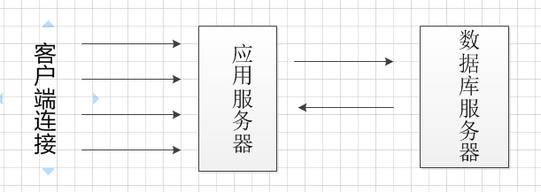
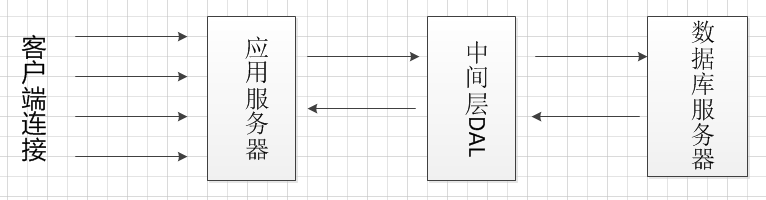
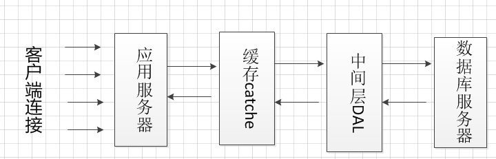
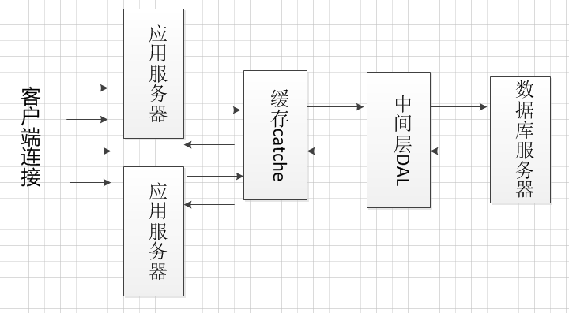
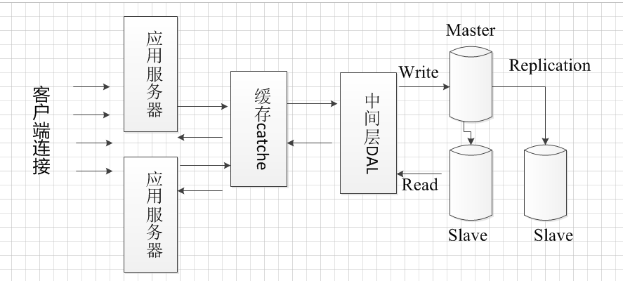
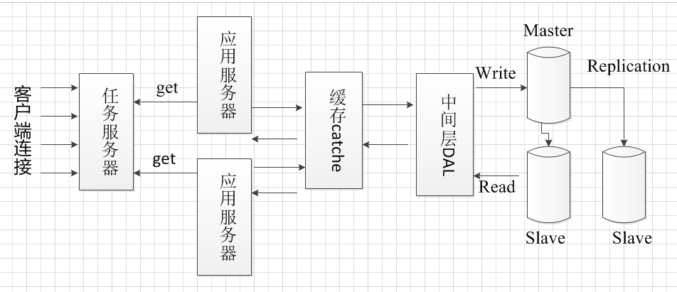
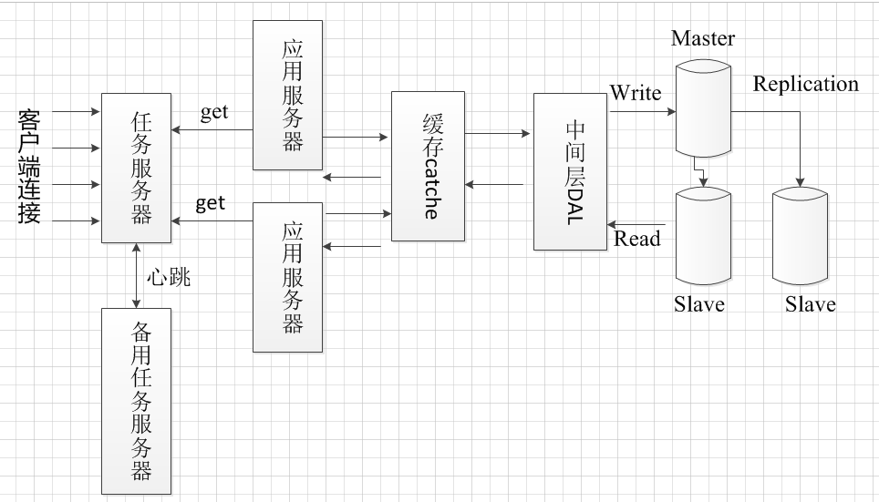

简单谈一谈`大并发服务器框架`设计的基本思路
基本的服务器框架都是`C/S结构`的，请求和相应流程是这样的：

这样的框架存在一个很严重的问题，当客户端大并发请求到来，服务器需要进行大量的数据库操作，假设数据库最大连接数为1000个，此时有10000个请求访问应用服务器，那么应用服务器只能处理1000个请求，剩下99000个等待1000个请求处理好后再进行访问数据库处理。可以在应用服务器和数据库服务器中间增加中间层DAL，DAL采用缓冲队列和连接池设计。
<!--more-->

DAL设计缓冲队列，存储等待的请求，并且DAL中设计数据库连接池，当数据库连接池中有空闲连接，那么从缓冲队列中取出一个请求处理，以此类推。这种做法有效的降低了服务器的压力，但是没有提高处理速度，仅仅保证了请求被缓存，处理效率仍受限于数据库的并发数。那么可以再增加一层缓存，将常用的数据加载如缓存，有请求到来时，应用服务器先从缓存中获取数据，如果缓存中有数据，那么不需要访问数据库，如果缓存中没有，在访问数据库取出数据，并更新缓存。

缓存如何同步？

有两种手段：

第一种方法： `缓存是具有时效的，在一定时间过后会超时timeout，如果缓存失效，那么重新去数据库查询，查询后更新缓存，这种方法不是实时的，实时性比较差。`

第二种方法：`当有请求修改数据时，更新缓存，并且将要修改的数据投入DAL层，当数据库有空闲连接时，再持久化存盘。`

缓存的不足之处：

当缓存足够多时，需要将不活跃缓存数据换出内存，叫做缓存换页。缓存换出算法和操作系统换页算法类似，`FIFO`，`LRU（least recently used）`，`LFU（least  frequently used）`等。实际缓存的实现不需要自己去实现，有很多开源技术，nosql技术就是非关系型数据库的意思。非关系型数据库如redis，memcatched等。缓存可以跟应用服务器部署在同一台机器上，也可以部署在单独机器上。我推荐将缓存服务器部署在单独机器上，假设有两台应用服务器，如果将缓存部署在不同的应用服务器上，那么不同的应用服务器很难访问彼此的缓存，非常不方便。将缓存部署在单独服务器上，各个应用服务器都能访问该缓存服务器。

如果有大量的业务请求到来，虽然设计了多个应用服务器，也架设了缓存服务器，完善了中间层的缓冲队列和数据库连接池，但是数据库服务器仍然会出现瓶颈。比如当有大量复杂的写操作数据库，很多读数据库的操作就被阻塞了，为解决这个问题可将数据库实现读写分离。由于数据库读操作会比写操作多，那么可以对数据库执行负载均衡。主流数据库都有replication机制，采用replication机制可以实现负载均衡。中间层的写数据库操作投递到master数据库中，读操作从slave数据库中读取，当master数据库中数据被修改后，数据库采用replication机制将数据同步给slave服务器。

同样的道理，应用服务器也可以实现负载均衡，架设多个应用服务器，不同的请求分配给不同的应用服务器。可单独设计一个任务服务器监控各个应用服务器的负载情况，合理的分配任务给各个应用服务器。这种方式是任务服务器主动地分配任务给应用服务器，应用服务器被动的接受任务，这种方式在任务请求类型相近的情况下，分配方式非常合理。但是假设应用服务器A接受了3个任务，应用服务器B接受了5个任务，按照负载均衡的权重法或最小连接法，肯定会分配给A任务，但是如果这3个任务都是复杂的写操作，而B的5个任务都是简单的读操作，那么这就存在分配的不合理性，如何解决这个问题呢？

可以换一种思路去解决这个问题，让应用服务器主动去请求任务服务器，主动获取任务处理，如果应用服务器处于忙碌状态就不需要请求新的任务，空闲的应用服务器会去请求任务服务器中的任务，这是最合理的负载均衡。如果所有应用服务器都处于忙碌状态，那么任务服务器将任务缓存至自己的任务队列，当应用服务器空闲时会来取任务。考虑这样一个问题，如果任务服务器出现故障怎么办？任务服务器需要有多台，并且实现failover机制，多台任务服务器之间实现心跳，如果检测不到对方心跳，则使自己成为主任务服务器。

到目前为止，这个框架可以适用于大部分服务器逻辑。为保证数据库的响应速度和处理效率，可以对数据库进行分区。

数据库分区有两种形式(分库、分表)

分库：数据库可以按照一定的逻辑把表分散到不同的数据库。这叫做垂直分区，就是所每个库的表不同，功能不同。这样做不常见，因为很大情况下，数据库中各个表是关联的，

如果将不同的表分配到不同的数据库中，会存在很多不便。

分表：将一个表的不同数据分配到各个数据库，这样每个数据库的表结构是一样的，只是存储的用户数据不同而已，叫做水平分区。分表的方式很常见，如果数据库的压力增加，

我们就采取分表的方式减少数据库的压力。

 

另外服务器开发的几个性能杀手：

1 数据拷贝，数据从内核态copy到用户态，或者在用户态之间copy会造成性能损失，尽量采用缓存的方式解决。

2 环境切换 ，多线程上下文切换造成开销。如果服务器是单核的，那么采用状态机方式单线程效果最佳。如果是多核的，

合理采用多线程，可以提升性能。

3 内存分配，可以采用内存池，提前分配。

4 锁竞争，加锁解锁会造成一定的效率衰减。