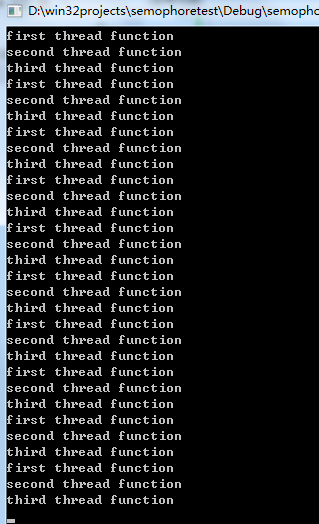

`semophore`是信号量的意思，常用于`PV操作`，所谓PV操作就是pend(等待，直到有资源可用，并且消耗资源)V就是释放资源。  
`semophore和mutex区别`，`mutex`本意为互斥，用于线程独占资源，常用于临界区访问锁住mutex，当线程A对mutex加锁后，其他线程不能反问临界资源，也不能加锁，直到线程A解锁，其他线程才能访问。而semophore则可以在不同的线程之间进行pv操作，semophore可以设置最多有多少个`信号量`，以及初始的信号量，当调用`V操作`的时候信号量数量增加一个，调用`P操作`时候信号量数量减少一个，但是不能超过最多的信号量。信号量是一个非负数。<!-- more -->  
打个比方，一辆车只有一把钥匙，mutex就是这把钥匙，谁有这把钥匙才能开车，开完车把钥匙归还或者给下一个等待的人。现在有一辆公交车，最多容纳二十个人，二十就是信号量的最大值，每个人就是一个信号量，当人满的时候其他的人就不能上车，直到有人下车，其他人才能上车。  

`semophore主要适用于windows环境下的同步`  
## 下面介绍下semophore
### 1 `创建信号量`
``` cpp
HANDLE WINAPI CreateSemaphore(              
  _In_opt_  LPSECURITY_ATTRIBUTES lpSemaphoreAttributes 
  _In_      LONG lInitialCount, 
  _In_      LONG lMaximumCount, 
  _In_opt_  LPCTSTR lpName 
); 
第一个参数：安全属性，如果为NULL则是默认安全属性 
第二个参数：信号量的初始值，要>=0且<=第三个参数 
第三个参数：信号量的最大值 
第四个参数：信号量的名称 
返回值：指向信号量的句柄，如果创建的信号量和已有的信号量重名，那么返回已经存在的信号量句柄
```

### 2`打开其他进程中的信号量`
``` cpp
HANDLE WINAPI OpenSemaphore(  
  _In_  DWORD dwDesiredAccess,  
  _In_  BOOL bInheritHandle,  
  _In_  LPCTSTR lpName  
);  
```

`dwDesiredAccess`：指定想要的访问权限，SEMAPHORE_ALL_ACCESS 请求对事件对象的完全访问，SEMAPHORE_MODIFY_STATE 修改状态权限，使用ReleaseSemaphore函数需要该权限；  
`bInheritHandle`：是否希望子进程继承信号量对象的句柄，一般设置为false；  
`lpName`：要打开的信号量对象的名称；  

### 3`等待信号量`
``` cpp
DWORD WINAPI WaitForSingleObject(  
  _In_  HANDLE hHandle,  
  _In_  DWORD dwMilliseconds  
);  
```
`hHandle`：指向内核对象的句柄；  
`dwMilliseconds`：线程最大等待多长时间，直到该对象被触发。经常使用INFINITE，表示阻塞等待。  
`WaitForSingleObject`为等待资源的函数，等待内核对象被触发的通用函数，在这里用于等待信号量，我们之前说过信号量的资源数是非负整数，当信号量数量大于0，那么该函数会将信号量-1，并且返回，线程继续执行后续操作。如果信号量资源数为0，那么该线程处于等待状态，阻塞等待信号量被激活。  
### 4 `释放信号量`
``` cpp
BOOL WINAPI ReleaseSemaphore(  
  _In_       HANDLE hSemaphore,  
  _In_       LONG lReleaseCount,  
  _Out_opt_  LPLONG lpPreviousCount  
);  
```
`hSemaphore`：信号量内核对象的句柄；  
lReleaseCount：释放自己使用的资源数目，加到信号量的当前资源计数上，通常会传1，当然是根据线程使用的资源数目而定。  
lpPreviousCount：返回当前资源计数的原始值，应用程序很少会用到这个值，所以一般置为NULL；  
当一个线程使用完信号量对象控制的有限资源后，应该调用ReleaseSemaphore，释放使用的资源，使信号量对象的当前资源计数得到恢复。
### 5`关闭内核对象的句柄`
``` cpp
BOOL WINAPI CloseHandle(  
  _In_  HANDLE hObject  
);  
```

`hObject`：指向内核对象的句柄和其他内核对象一样，无论以什么方式创建内核对象，我们都必须通过调用CloseHandle向系统表明结束使用内核对象。如果传入的句柄有效，系统将获得内核对象数据结构的地址，并将结构中的使用计数减1，如果使用计数0，就会将内核对象销毁，从内存空间中擦除。  
下面写一个例子，三个线程，分别为如数1,2,3，要求每个线程输出10此，以1,2,3分别输出。
``` cpp
//先定义三个信号量句柄：

HANDLE hsem1,hsem2,hsem3;
 

//线程回调函数：


unsigned __stdcall threadFunA(void *)
{
    for(int i = 0; i < 10; i++){
        WaitForSingleObject(hsem1, INFINITE);//等待信号量
        cout<<"first thread function"<<endl;
        ReleaseSemaphore(hsem2, 1, NULL);//释放信号量2
    }
    return 1;
}

//该函数内部调用等待第一个信号量，如果获得资源，则打印日志，并且释放资源2

//同样的道理，完成第二个，第三个线程回调函数


unsigned __stdcall threadFunB(void *)
{
    for(int i = 0; i < 10; i++){
        WaitForSingleObject(hsem2, INFINITE);//等待信号量
        cout<<"second thread function"<<endl;
        ReleaseSemaphore(hsem3, 1, NULL);//释放信号量3
    }
    return 2;
}

 unsigned  __stdcall threadFunC(void *)
 {
    for(int i = 0; i < 10; i++){
        WaitForSingleObject(hsem3, INFINITE);//等待信号量
        cout<<"third thread function"<<endl;
        ReleaseSemaphore(hsem1, 1, NULL);//释放信号量
    }
    return 3;
 }

//接下来在主函数创建三个线程，并且初始化第一个信号量的初始资源数为1，

//第二个和第三个信号量初始资源数都是0，他们的最大资源数为1.


//创建信号量
    hsem1 = CreateSemaphore(NULL, 1, 1, NULL);
    hsem2 = CreateSemaphore(NULL, 0, 1, NULL);
    hsem3 = CreateSemaphore(NULL, 0, 1, NULL);

    HANDLE hth1, hth2, hth3;
 
    //创建线程
    hth1 = (HANDLE)_beginthreadex(NULL, 0, threadFunA, NULL, 0, NULL);
    hth2 = (HANDLE)_beginthreadex(NULL, 0, threadFunB, NULL, 0, NULL);
    hth3 = (HANDLE)_beginthreadex(NULL, 0, threadFunC, NULL, 0, NULL);
 

//当线程调用完回调函数才能让主线程退出，linux系统对应的api为pthread_join()，

//我们这里windows api为 WaitForSingleObject

//等待子线程结束
    WaitForSingleObject(hth1, INFINITE);
    WaitForSingleObject(hth2, INFINITE);
    WaitForSingleObject(hth3, INFINITE);
 

 //最后释放线程的句柄和信号量的句柄


 //一定要记得关闭线程句柄
    CloseHandle(hth1);
    CloseHandle(hth2);
    CloseHandle(hth3);
    CloseHandle(hsem1);
    CloseHandle(hsem2);
    CloseHandle(hsem3);

```
打印输出如下：

结果显示三个线程是按顺序输出的。所以信号量常用来同步线程。  
源代码下载地址：[semophore测试](http://download.csdn.net/detail/secondtonone1/9654799)

