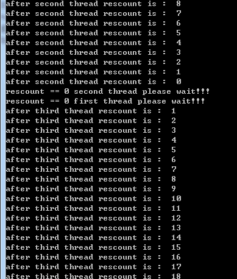
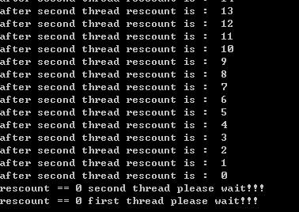

linux 环境有提供好的`pthread_cond_wait()` 和 `phread_signal()`、`pthread_broadcast()`windows需要自己封装，利用`semophore`控制线程等待和释放，先简单谈一下设计好后api该如何使用。假设我们封装好条件变量等待函数名字叫做`wait(Mutex& mutex)`，Mutex是之前我们封装的条件变量，文章最下边会给出这些文件的下载地址，在这里读者当做linux 的mutex即可。我们封装的释放函数为`signal()`,广播函数为`broadcast`。
<!-- more -->  
判断等待条件变量和逻辑处理如下：  
``` cpp
Lock(mutex);

while(条件不满足)

{

 　  wait(mutex);

}

todo...;

UnLock(mutex);
```

激活条件变量如下：  
``` Cpp
Lock(mutex);

　　todo ...;　

　　if(条件满足)

　　{

　　　　signal();/broadcast();

　　}　

signal();

UnLock(mutex);
```
Condition 是我们封装的条件变量类这是封装好api后调用规则，那么先考虑wait内部的基本形式  
``` C++
void Condition::wait(Mutex &mutex)

{

　　//1 Condition 类中表示阻塞线程数　

　　mblocked ++;

　　//2 解锁，释放互斥量

　　UnLock(mutex);

　　//3 阻塞等待 mQueue为信号量

　  res = WaitForSingleObject(reinterpret_cast<HANDLE>(mQueue), INFINITE);

　  //4 做一些判断和逻辑处理

　　//5　加锁

 　Lock(mutex);

}
```
wait内部记录一个阻塞的线程数mblocked，mblocked 是我们封装Condition类的成员变量，
然后释放外部的互斥量，然后调用阻塞函数，等待signal唤醒。  
当WaitForSingleObject获取信号后会继续执行，做一些逻辑判断，最后将mutex锁住。
这里用到的mQueue是一个信号量，用信号量可以接受多个唤醒和控制线程唤醒数量。  
下面是条件变量释放的函数，我们先做只是放一个条件变量的api  
``` c++
void Condition::signal()

{

　　//1阻塞的线程减少

　　mblocked --;

　　//2将激活的信号个数设置为1

　　signals = 1;

　　//3

　　if (signals)

　　{

　　　　//释放信号量
　　　　res = ReleaseSemaphore(reinterpret_cast<HANDLE>(mQueue), signals, 0);
　　　　ASSERT(res);
　　}

}
```
先不要着急往下写，考虑下这么做真的合适么？  
首先之前设计过外部调用
``` cpp
if(条件满足)

　　{

　　　　signal();/broadcast();

　　}　
```
这个只要条件满足就可以激活，所以我们只用mblocked表示阻塞线程数是不够的，当信号量被激活很多没有被消耗的情况下就需要统计当前可用的资源数，那么就在Condition类添加mWait表示当前可用的信号量个数。除此之外，考虑这样一种情况，当条件不满足的时候 线程A调用void wait(Mutex &mutex)函数，wait函数先解锁再阻塞，对应wait中第2,3步骤。而另一个线程B当条件满足时调用 signal函数激活之前阻塞的线程A，对应signal函数中第3步。原阻塞线程A因为捕获到信号量，所以一次走到wait中第4、5步。由于第4和第5步之间没有加锁保护，所以这一阶段用到的类的成员变量都是不安全的。所以在第3和第4之间加一个互斥锁，第5步之后释放这个互斥锁。同样的道理，为了避免此时signal内部调用类的成员变量造成数据不一致所以signal内部也需要加锁，在signal内部第1步之前加锁，第3步之后解锁，或者第3步之前解锁都可以。我觉得在第三步之前释放会好一些，在释放信号量之前解锁，避免死锁。所以添加一个成员变量mMutex用于部分代码互斥。  
那么改良后我们的函数如下：  

``` cpp
void
Condition::wait(Mutex& mutex)
{
　　#ifndef WIN32
    　　int ret = pthread_cond_wait(&mId, mutex.getId());
    　　ASSERT(ret == 0);
　　#else
    //1
    mBlocked++;<br>        //2
    　　mutex.unlock();
 
    　　int res = 0;<br>　　　　 //3
   　　 res = WaitForSingleObject(reinterpret_cast<HANDLE>(mQueue), INFINITE);
    　　ASSERT(res == WAIT_OBJECT_0);
     
    //用于暂时存储mWaiting的数值
   　　  unsigned wasWaiting = 0;
   　　 //4
    　　res = WaitForSingleObject(reinterpret_cast<HANDLE>(mMutex), INFINITE);
    　　ASSERT(res == WAIT_OBJECT_0);
    　　wasWaiting = mWaiting;
   　　 //5
   　　 res = ReleaseMutex(reinterpret_cast<HANDLE>(mMutex));
    　　ASSERT(res);
　　　　//6
  　　　mutex.lock();
#endif
}
```
步骤也做了相应的调整。  
``` cpp
void
Condition::signal ()
{
#ifndef WIN32
    int ret = pthread_cond_signal(&mId);
    ASSERT(ret == 0);
#else
    unsigned signals = 0;

    int res = 0;
　　//1
    res = WaitForSingleObject(reinterpret_cast<HANDLE>(mMutex), INFINITE);
    ASSERT(res == WAIT_OBJECT_0);
　　//2
    if (mWaiting != 0) 
    {
        if (mBlocked == 0)
        {
            res = ReleaseMutex(reinterpret_cast<HANDLE>(mMutex));
            ASSERT(res);
            return;
        }

        ++mWaiting;
        --mBlocked;
        signals = 1;
    }
    else
    {
        signals = mWaiting = 1;
        --mBlocked;
            
    }
　　//3
    res = ReleaseMutex(reinterpret_cast<HANDLE>(mMutex));
    ASSERT(res);
　　//4
    if (signals)
    {
        res = ReleaseSemaphore(reinterpret_cast<HANDLE>(mQueue), signals, 0);
        ASSERT(res);
    }
#endif
}
```
改良后更新了步骤，注释的就是步骤，方便接下来讨论这两段代码的隐患，因为仅仅这些还不够。目前现总结下mMutex作用：

`1 mMutex用于signal函数内部和wait函数 获取信号量之后的代码互斥，保护类的常用变量。`  

`2 当不同的线程调用wait等待后获得激活时，mMutex保证获得信号量之后的操作是互斥的，安全的。`  

由于调用wait函数之前需要加外部的互斥锁，所以不同的线程调用wai函数时第一步的mBlocked++是互斥的，不会出错。  

唯一有可能出错的是那种情况呢？  

就是当signal发出信号后，当前有一个因为调用wait阻塞的线程A捕获到该信号，进入第四步，修改或者访问mBlocked变量的值，与此同时有线程A调用wait函数，此时会进入wait内部第一步mBlocked++，多线程修改和读取mBlocked会造成数据混乱，所以此时需要在第一步之前加锁，第2步之前解锁，因此添加单个信号量mGate，用于控制当有线程处于解锁状态处理mBlocked等类成员时，其他线程进入wait修改mBlocked值。  
这个res = WaitForSingleObject(reinterpret_cast<HANDLE>(mGate), INFINITE);可以放在wait函数第4步之后，当第4步获得互斥资源后，阻塞等待获取mGate信号，如果没获得需要等待别的线程释放mGate，如果此时mGate不被释放造成mMutex死锁。所以别的线程中先调用 WaitForSingleObject(reinterpret_cast<HANDLE>(mGate), INFINITE);后调用WaitForSingleObject mMutex会造成死锁。需要特别注意。如果规避了这一点，那么就可以避免死锁。所有情况都对mGate互斥访问并不友好，出现之前讨论的情况只有一种：就是当前应用程序中至少有一个线程处于等待，而signal释放信号后，某一个等待的线程继续执行4后面的操作，外界有新的线程调用wait时修改mBlocked会出错。所以只需要在signal函数中判断当mWaiting数量为0时对mGate加锁，mWait根据不同情况进行对mGate进行释放。  
修改后的代码如下：  

``` cpp
void
Condition::enterWait ()
{
    int res = 0;
    res = WaitForSingleObject(reinterpret_cast<HANDLE>(mGate), INFINITE);
    ASSERT(res == WAIT_OBJECT_0);
    ++mBlocked;
    res = ReleaseSemaphore(reinterpret_cast<HANDLE>(mGate), 1, 0);
    ASSERT(res);
}
```
对mBlocked起到保护作用  
``` cpp
void
Condition::wait(Mutex& mutex)
{
#ifndef WIN32
    int ret = pthread_cond_wait(&mId, mutex.getId());
    ASSERT(ret == 0);
#else
    //1
　　enterWait();
　　//2
    mutex.unlock();

    int res = 0;
　　//3
    res = WaitForSingleObject(reinterpret_cast<HANDLE>(mQueue), INFINITE);
    ASSERT(res == WAIT_OBJECT_0);

    unsigned wasWaiting = 0;
    unsigned wasGone = 0;
　　//4
    res = WaitForSingleObject(reinterpret_cast<HANDLE>(mMutex), INFINITE);
    ASSERT(res == WAIT_OBJECT_0);
    wasWaiting = mWaiting;
    wasGone = mGone;
　　//signal释放资源后，mWaiting 至少为1
    if (wasWaiting != 0)
    {
　　　　//判断mWaiting 数量为1
        if (--mWaiting == 0)
        {
　　　　　　　//如果当前没有阻塞线程则释放mGate
            if (mBlocked != 0)
            {
                res = ReleaseSemaphore(reinterpret_cast<HANDLE>(mGate), 1, 0); // open mGate
                ASSERT(res);
                wasWaiting = 0;
            }
           
        }
    }
   //5
    res = ReleaseMutex(reinterpret_cast<HANDLE>(mMutex));
    ASSERT(res);
　　//6
    mutex.lock();
#endif
}
```
对应的signal函数：  
``` cpp
void
Condition::signal ()
{
#ifndef WIN32
    int ret = pthread_cond_signal(&mId);
    ASSERT(ret == 0);
#else
    unsigned signals = 0;

    int res = 0;
　　//1
    res = WaitForSingleObject(reinterpret_cast<HANDLE>(mMutex), INFINITE);
    ASSERT(res == WAIT_OBJECT_0);
　　
    if (mWaiting != 0) 
    {
　　　　//当前有空闲的信号量并且没由阻塞的线程
        if (mBlocked == 0)
        {
            res = ReleaseMutex(reinterpret_cast<HANDLE>(mMutex));
            ASSERT(res);
            return;
        }
　　　　//如果由阻塞的线程，那么阻塞数量--
        ++mWaiting;
        --mBlocked;
        signals = 1;
    }
    else
    {
       //2当空闲的信号量为0时，互斥获得mGate
　　　　 res = WaitForSingleObject(reinterpret_cast<HANDLE>(mGate), INFINITE);
        ASSERT(res == WAIT_OBJECT_0);
　　　　 //3
        if (mBlocked )
        {
          　//如果当前有线程阻塞那么更新计数
            signals = mWaiting = 1;
            --mBlocked;
        }
        else
        {
　　　　　　 //由于用户外部不判断条件是否成立多次调动signal，此处不处理直接释放mGate
            res = ReleaseSemaphore(reinterpret_cast<HANDLE>(mGate), 1, 0);
            ASSERT(res);
        }
    }

　　//4
    res = ReleaseMutex(reinterpret_cast<HANDLE>(mMutex));
    ASSERT(res);

　　//5
    if (signals)
    {
        res = ReleaseSemaphore(reinterpret_cast<HANDLE>(mQueue), signals, 0);
        ASSERT(res);
    }
#endif
}
```
到目前为止，对于共享对象的保护和同步都做的比较完善了，还要注意一个问题就是虚假唤醒。这是操作系统可能出现的一种情况，所以需要添加虚假唤醒的逻辑用mGone成员变量表示出错的或是虚假唤醒的线程数  
最终代码如下：
``` cpp
void
Condition::wait(Mutex& mutex)
{
#ifndef WIN32
    int ret = pthread_cond_wait(&mId, mutex.getId());
    ASSERT(ret == 0);
#else
    enterWait();

    mutex.unlock();

    int res = 0;
    res = WaitForSingleObject(reinterpret_cast<HANDLE>(mQueue), INFINITE);
    ASSERT(res == WAIT_OBJECT_0);

    unsigned wasWaiting = 0;
    unsigned wasGone = 0;

    res = WaitForSingleObject(reinterpret_cast<HANDLE>(mMutex), INFINITE);
    ASSERT(res == WAIT_OBJECT_0);
    wasWaiting = mWaiting;
    wasGone = mGone;
    if (wasWaiting != 0)
    {
        if (--mWaiting == 0)
        {
            if (mBlocked != 0)
            {
                res = ReleaseSemaphore(reinterpret_cast<HANDLE>(mGate), 1, 0); // open mGate
                ASSERT(res);
                wasWaiting = 0;
            }
            else if (mGone != 0)
            {
                mGone = 0;
            }
        }
    }
    else if (++mGone == (ULONG_MAX / 2))
    {
        res = WaitForSingleObject(reinterpret_cast<HANDLE>(mGate), INFINITE);
        ASSERT(res == WAIT_OBJECT_0);
        mBlocked -= mGone;
        res = ReleaseSemaphore(reinterpret_cast<HANDLE>(mGate), 1, 0);
        ASSERT(res);
        mGone = 0;
    }
    res = ReleaseMutex(reinterpret_cast<HANDLE>(mMutex));
    ASSERT(res);

    if (wasWaiting == 1)
    {
        for (; wasGone; --wasGone)
        {
            res = WaitForSingleObject(reinterpret_cast<HANDLE>(mQueue), INFINITE);
            ASSERT(res == WAIT_OBJECT_0);
        }
        res = ReleaseSemaphore(reinterpret_cast<HANDLE>(mGate), 1, 0);
        ASSERT(res);
    }

    mutex.lock();
#endif
}
```
wait部分添加了mGone的处理，当mWaiting数量为0进入  
res = WaitForSingleObject(reinterpret_cast<HANDLE>(mMutex), INFINITE);  
需要对mGone++表示虚假唤醒的线程数量  
``` cpp
if (++mGone == (ULONG_MAX / 2))
    {
        res = WaitForSingleObject(reinterpret_cast<HANDLE>(mGate), INFINITE);
        ASSERT(res == WAIT_OBJECT_0);
        mBlocked -= mGone;
        res = ReleaseSemaphore(reinterpret_cast<HANDLE>(mGate), 1, 0);
        ASSERT(res);
        mGone = 0;
    }
```
通过mGate对mBlocked保护起来，当唤醒的个数超过指定值会把多余的mblocked去掉并且把
虚假唤醒数量置空。举个例子，当mBLocked为1时该线程被虚假唤醒，那么mGone变为1，由于是
虚假唤醒，用户在外部调用wait函数时通过while循环判断条件不满足再次进入wait中enterGate
函数对mBlocked自增，此时mBlocked数量为2，所以当冗余的mBlocked超过指定值，就回去掉
这些mBlocked并将mGone置空。
``` cpp
if (wasWaiting == 1)
{
   for (; wasGone; --wasGone)
   {
    res = WaitForSingleObject(reinterpret_cast<HANDLE>(mQueue), INFINITE);
    ASSERT(res == WAIT_OBJECT_0);
   }
   res = ReleaseSemaphore(reinterpret_cast<HANDLE>(mGate), 1, 0);
   ASSERT(res);
}
```
该函数判断Condation类的mWating变量有1变为0，并且阻塞的线程数为0，因为如果用户没有在外边调用while
判断条件导致虚假唤醒引起逻辑错误，所以为了起到保护作用对那些因为虚假唤醒错过的信号进行资源占用，
直到信号量都被释放后才进入mGate释放。举一个例子如果外部调用
``` cpp
Lock(mutex);
if(条件不满足)
{
　　wait(mutex);
　　
}
//逻辑处理
　　　　...
UnLock(mutex);
```

当wait执行退出后会执行逻辑，而没有while判断条件是否真的满足。所以我们要对信号量进行控制，保证信号量
数量正确。并且和mBlocked，mWait,等一致。  
下面是signal函数最终版本  
``` cpp
void
Condition::signal ()
{
#ifndef WIN32
    int ret = pthread_cond_signal(&mId);
    ASSERT(ret == 0);
#else
    unsigned signals = 0;

    int res = 0;
    res = WaitForSingleObject(reinterpret_cast<HANDLE>(mMutex), INFINITE);
    ASSERT(res == WAIT_OBJECT_0);

    if (mWaiting != 0) 
    {
        if (mBlocked == 0)
        {
            res = ReleaseMutex(reinterpret_cast<HANDLE>(mMutex));
            ASSERT(res);
            return;
        }

        ++mWaiting;
        --mBlocked;
        signals = 1;
    }
    else
    {
        res = WaitForSingleObject(reinterpret_cast<HANDLE>(mGate), INFINITE);
        ASSERT(res == WAIT_OBJECT_0);
        if (mBlocked > mGone)
        {
            if (mGone != 0)
            {
                mBlocked -= mGone;
                mGone = 0;
            }
            signals = mWaiting = 1;
            --mBlocked;
        }
        else
        {
            res = ReleaseSemaphore(reinterpret_cast<HANDLE>(mGate), 1, 0);
            ASSERT(res);
        }
    }

    res = ReleaseMutex(reinterpret_cast<HANDLE>(mMutex));
    ASSERT(res);

    if (signals)
    {
        res = ReleaseSemaphore(reinterpret_cast<HANDLE>(mQueue), signals, 0);
        ASSERT(res);
    }
#endif
}
```
同样的道理  
``` cpp
 if (mBlocked > mGone)
  {
     if (mGone != 0)
     {
          mBlocked -= mGone;
          mGone = 0;
     }
     signals = mWaiting = 1;
     --mBlocked;
 }
```
这个逻辑就是处理当虚假唤醒的mBlocked和mGone等数据准确性。因为如果是虚假唤醒，用户通过while(条件不满足)这个方式继续调用wait会导致mBlocked++，假设就一个线程处于阻塞并且因为虚假唤醒通过while循环重新调用wait函数，而此时mGone比mBlocked小1，所以mBlocked - mGone就是更新差值给mBlocked，这是真正的处于阻塞的线程数量。  

下面是代码下载地址：  
[betternet](http://download.csdn.net/detail/secondtonone1/9658645)  

代码效果测试截图：

  

