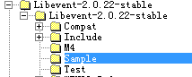

libevent中提供了一个Hello-world.c 的例子，从这个例子可以学习libevent是如何使用bufferevent的。
这个例子在Sample中

这个例子之前讲解过，这次主要看下bufferevent的使用。
<!--more-->
## 第一步找到main函数

main函数

``` cpp
int main(){
   //...
listener = evconnlistener_new_bind(base, listener_cb, (void *)base,
        LEV_OPT_REUSEABLE|LEV_OPT_CLOSE_ON_FREE, -1,
        (struct sockaddr*)&sin,
        sizeof(sin));

 //...

　　　　event_base_dispatch(base);

　　　　evconnlistener_free(listener);
　　　　event_free(signal_event);
　　　　event_base_free(base);

　　　　printf("done\n");
　　　　return 0;


}
```
main函数中调用evconnlistener_new_bind()创建了一个evconnlistener 类型的listener,然后拍发消息，之后释放各种资源。

## 第二步在evconnlistener_new_bind()中调用evconnlistener_new()完成listener属性设置。

这个函数里对evconnlistener_event中base进行回调函数的绑定和参数设置，通过event_assign将evconnlistener_event的istener设置读事件的回调函数，并且通过evconnlistener_enable让读回调函数触发，也就是触发listener_read_cb。这里evconnlister_enable调用的也是结构体注册的enable具体看代码吧，调用的是r = lev->ops->enable(lev);等同于调用event_listener_enable，该函数内部完成event_add。

``` cpp
struct evconnlistener_event {
　　　　struct evconnlistener base;
　　　　struct event listener;
};


struct evconnlistener *
evconnlistener_new(struct event_base *base,
    evconnlistener_cb cb, void *ptr, unsigned flags, int backlog,
    evutil_socket_t fd)
{
    struct evconnlistener_event *lev;//开辟evconnlistener_event大小区域
    lev = mm_calloc(1, sizeof(struct evconnlistener_event));
    if (!lev)
        return NULL;
    //lev -> base 表示  evconnlistener 
    //evconnlistener     evconnlistener_ops 基本回调参数和回调函数结构体赋值
    lev->base.ops = &evconnlistener_event_ops;
    //evconnlistener_cb 设置为listener_cb
    lev->base.cb = cb;
    //ptr表示event_base 指针
    lev->base.user_data = ptr;
    lev->base.flags = flags;
    lev->base.refcnt = 1;//  lev   is evconnlistener_event       
    //lev->listener is event
    //为lev->listener设置读回调函数和读关注事件，仅进行设置并没加入event队列
    event_assign(&lev->listener, base, fd, EV_READ|EV_PERSIST,
        listener_read_cb, lev);
    //实际调用了event_add将事件加入event队列
    evconnlistener_enable(&lev->base);

    return &lev->base;
}
```
 
## 第三步listener_read_cb内部调用accept生成新的socket处理连接，调用listener_cb

新的socket作为参数传递给evconnlistener_event中base的回调函数listener_cb

``` cpp
static void
listener_read_cb(evutil_socket_t fd, short what, void *p)
{
    struct evconnlistener *lev = p;
    int err;
    evconnlistener_cb cb;
    evconnlistener_errorcb errorcb;
    void *user_data;
    LOCK(lev);
    while (1) {
      　　//...//cb 就 是  listener_cb
        cb = lev->cb;
        user_data = lev->user_data;
        UNLOCK(lev);
        //触发了listener_cb
        
        //完成了eventbuffer注册写和事件函数  
        cb(lev, new_fd, (struct sockaddr*)&ss, (int)socklen,
            user_data);
        
        LOCK(lev);
        if (lev->refcnt == 1) {
            int freed = listener_decref_and_unlock(lev);
            EVUTIL_ASSERT(freed);
            return;
        }
        --lev->refcnt;
    }
  //...
}
```

## 第四步listener_cb 调用bufferevent_socket_new 生成bufferevent，

然后bufferevent_setcb设置读写水位触发的回调函数，bufferevent_enable将bufferevent的写事件加入监听，即开始检测写事件。关闭读事件，并且向outbuf中写入MSG
bufferevent_socket_new内部绑定bufferevent的读写事件回调函数，读事件为bufev->ev_read，绑定了bufferevent_readcb回调函数，
写事件为bufev->ev_write，
绑定了bufferevent_writecb回调函数。这两个回调函数和bufferevent的readcb和writecb是不一样的，这两个函数在对应的读写事件激活时才触发。
而readcb和writecb是基于水位线达到阈值才会触发。做好区分。bufferevent_socket_new内部还对bufev->output添加了对调函数bufferevent_socket_outbuf_cb，
bufferevent_socket_outbuf_cb内部检测是否开启写事件，以及是否可写，如果可写，同样将写事件加入监听队列，也就是调用了event_add。
bufferevent_socket_new内部解释完毕了。bufferevent_setcb设置的是读写水位达到阈值后的回调函数，
bufferevent_enable内部也是调用了event_add，将读事件加入监听队列。
bufferevent_enable内部调用bufev->be_ops->enable(bufev, impl_events)，等同于be_socket_enable，另外bufferevent_write函数内部调用evbuffer_add，
evbuffer_add内部调用了evbuffer_invoke_callbacks，就会调用绑定在output buffer上的回调函数bufferevent_socket_outbuf_cb。

``` cpp
static void
listener_cb(struct evconnlistener *listener, evutil_socket_t fd,
    struct sockaddr *sa, int socklen, void *user_data)
{
    struct event_base *base = user_data;
    struct bufferevent *bev;

    bev = bufferevent_socket_new(base, fd, BEV_OPT_CLOSE_ON_FREE);
    if (!bev) {
        fprintf(stderr, "Error constructing bufferevent!");
        event_base_loopbreak(base);
        return;
    }
    //设置写回调和事件回调
    bufferevent_setcb(bev, NULL, conn_writecb, conn_eventcb, NULL);
    bufferevent_enable(bev, EV_WRITE);
    bufferevent_disable(bev, EV_READ);
    //将要发送的内容写入evbuffer结构
    bufferevent_write(bev, MESSAGE, strlen(MESSAGE));
}
``` cpp
 
``` cpp
struct bufferevent *
bufferevent_socket_new(struct event_base *base, evutil_socket_t fd,
    int options)
{
    struct bufferevent_private *bufev_p;
    struct bufferevent *bufev;

　　//...//设置bufferevent中   ev_read(event类型)回调函数
    event_assign(&bufev->ev_read, bufev->ev_base, fd,
        EV_READ|EV_PERSIST, bufferevent_readcb, bufev);
    //设置bufferevent中   ev_write(event类型)回调函数
    event_assign(&bufev->ev_write, bufev->ev_base, fd,
        EV_WRITE|EV_PERSIST, bufferevent_writecb, bufev);

    //为bufev->output(evbuffer类型)设置回调函数，插入bufferevent->output的callback队列
    //bufferevent_socket_outbuf_cb回调函数内部将ev_write事件加入事件队列
    evbuffer_add_cb(bufev->output, bufferevent_socket_outbuf_cb, bufev);

    evbuffer_freeze(bufev->input, 0);
    evbuffer_freeze(bufev->output, 1);
  　　//...

    return bufev;
}
``` 
``` cpp
static int
be_socket_enable(struct bufferevent *bufev, short event)
{
    if (event & EV_READ) {
        if (be_socket_add(&bufev->ev_read,&bufev->timeout_read) == -1)
            return -1;
    }
    if (event & EV_WRITE) {
        if (be_socket_add(&bufev->ev_write,&bufev->timeout_write) == -1)
            return -1;
    }
    return 0;
}
```
 

 

## 第五步 bufferevent的output中写入MSG， 并且之前也已经将EV_WRITE事件加入监听，所以内核检测到socket可写，会通知bufferevent的ev_write，调用绑定在ev_write上的函数bufferevent_writecb。

这是bufferevent内部的写操作，我们可以详细看一下。之前也有讲过bufferevent会将接收到的数据放到inputbuffer中，将outputbuffer中的数据发送。所以之前讲过的接口bufferevent_write让我们将要发送的数据放到output中，bufferevent_read可以从input中读出bufferevent接收到的数据。

``` cpp
static void
bufferevent_writecb(evutil_socket_t fd, short event, void *arg)
{
    struct bufferevent *bufev = arg;
    struct bufferevent_private *bufev_p =
        EVUTIL_UPCAST(bufev, struct bufferevent_private, bev);
    int res = 0;
    short what = BEV_EVENT_WRITING;
    int connected = 0;
    ev_ssize_t atmost = -1;
    //对 bufferevent加锁，支持多线程安全模式
    _bufferevent_incref_and_lock(bufev);
    //检测是否带有超时事件
    if (event == EV_TIMEOUT) {
        /* Note that we only check for event==EV_TIMEOUT. If
         * event==EV_TIMEOUT|EV_WRITE, we can safely ignore the
         * timeout, since a read has occurred */
        what |= BEV_EVENT_TIMEOUT;
        goto error;
    }
    //判断是否是连接事件
    if (bufev_p->connecting) {
        int c = evutil_socket_finished_connecting(fd);
        /* we need to fake the error if the connection was refused
         * immediately - usually connection to localhost on BSD */
        if (bufev_p->connection_refused) {
          bufev_p->connection_refused = 0;
          c = -1;
        }

        if (c == 0)
            goto done;

        bufev_p->connecting = 0;
        //连接失败删除该事件
        if (c < 0) {
            event_del(&bufev->ev_write);
            event_del(&bufev->ev_read);
            _bufferevent_run_eventcb(bufev, BEV_EVENT_ERROR);
            goto done;
        } else {
            connected = 1;
            //windows情况下直接运行事件回调函数，然后go done
#ifdef WIN32
            if (BEV_IS_ASYNC(bufev)) {
                event_del(&bufev->ev_write);
                bufferevent_async_set_connected(bufev);
                _bufferevent_run_eventcb(bufev,
                        BEV_EVENT_CONNECTED);
                goto done;
            }
#endif
    //linux 下 运行事件回调函数
            _bufferevent_run_eventcb(bufev,
                    BEV_EVENT_CONNECTED);
        //检测是否可写，不可写删除该事件
            if (!(bufev->enabled & EV_WRITE) ||
                bufev_p->write_suspended) {
                event_del(&bufev->ev_write);
                goto done;
            }
        }
    }
    //计算bufferevent能写的最大数量
    atmost = _bufferevent_get_write_max(bufev_p);
    //写事件挂起了，跳过。
    if (bufev_p->write_suspended)
        goto done;
    
    //output非空
    if (evbuffer_get_length(bufev->output)) {
        //将output的头打开，从头部发送
        evbuffer_unfreeze(bufev->output, 1);
        //bufferevent调用写操作，将outbuffer中的内容发送出去
        res = evbuffer_write_atmost(bufev->output, fd, atmost);
        //将output的头部关闭
        evbuffer_freeze(bufev->output, 1);
        if (res == -1) {
            int err = evutil_socket_geterror(fd);
            if (EVUTIL_ERR_RW_RETRIABLE(err))
                goto reschedule;
            what |= BEV_EVENT_ERROR;
        } else if (res == 0) {
            /* eof case
               XXXX Actually, a 0 on write doesn't indicate
               an EOF. An ECONNRESET might be more typical.
             */
             //写完了
            what |= BEV_EVENT_EOF;
        }
        if (res <= 0)
            goto error;
        //bufferevent减少发送的大小，留下未发送的，下次再发送，因为是PERSIST|WRITE
        //所以会在下次检测到可写时候继续写
        _bufferevent_decrement_write_buckets(bufev_p, res);
    }

    //计算是否将outbuf中的内容发送完，发完了就删除写事件
    if (evbuffer_get_length(bufev->output) == 0) {
        event_del(&bufev->ev_write);
    }

    /*
     * Invoke the user callback if our buffer is drained or below the
     * low watermark.
     */
     //将buffer中的内容发完，或者低于low 水位，那么调用用户注册的写回调函数
    //之前注册在bufev->writecb中的回调函数
    if ((res || !connected) &&
        evbuffer_get_length(bufev->output) <= bufev->wm_write.low) {
        _bufferevent_run_writecb(bufev);
    }

    goto done;

 reschedule:
    if (evbuffer_get_length(bufev->output) == 0) {
        event_del(&bufev->ev_write);
    }
    goto done;

 error:
    bufferevent_disable(bufev, EV_WRITE);
    _bufferevent_run_eventcb(bufev, what);

 done:
    _bufferevent_decref_and_unlock(bufev);
}
```
 
## 第六步：这个函数内部每次尽可能多的发送数据，  
  
没有发送完就下次轮询继续发送,直到水位低于或等于写数据的低水位，那么就会触发bufferevent低水位写回调函数。也就是conn_writecb，

在conn_writecb内部检测output buffer中数据为空，就释放该bufferevent。

``` cpp
static void
conn_writecb(struct bufferevent *bev, void *user_data)
{
    struct evbuffer *output = bufferevent_get_output(bev);
    if (evbuffer_get_length(output) == 0) {
        printf("flushed answer\n");
        bufferevent_free(bev);
    }
}
```
 

 

这就是整体流程，bufferevent内部的流畅看懂即可，我们只需要使用libevent提供的接口即可。