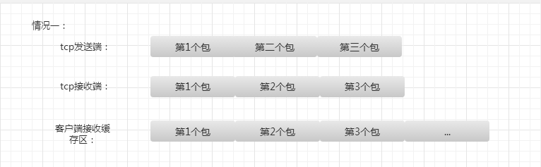
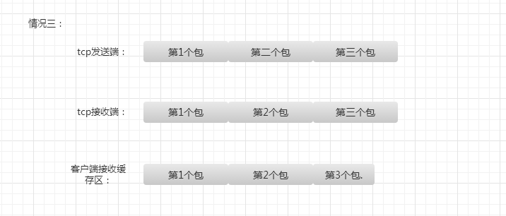
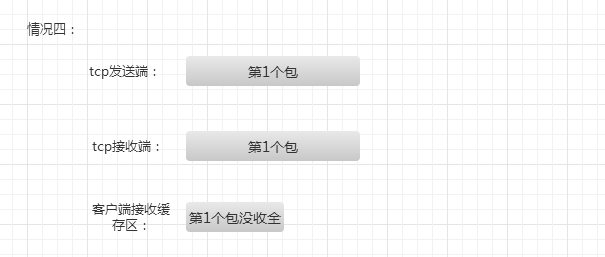

`TCP`（transport control protocol，`传输控制协议`）是`面向连接`的，面向流的，提供高可靠性服务。收发两端（客户端和服务器端）都要有一一成对的socket，

因此，发送端为了将多个发往接收端的包，更有效的发到对方，使用了优化方法（`Nagle算法`），将多次间隔较小且数据量小的数据，合`并成一个大的数据块`，

然后进行`封包`。这样，接收端，就难于分辨出来了，必须提供科学的拆包机制。即面向流的通信是无消息保护边界的。

`UDP`（user datagram protocol，用户数据报协议）是`无连接的`，`面向消息`的，提供高效率服务。不会使用块的合并优化算法，

由于UDP支持的是一对多的模式，所以接收端的`skbuff(套接字缓冲区）`采用了链式结构来记录每一个到达的UDP包，

在每个UDP包中就有了消息头（消息来源地址，端口等信息），这样，对于接收端来说，就容易进行区分处理了。 即`面向消息的通信是有消息保护边界的`。
<!-- more -->
## TCP粘包我总结了几种情况

tcp发送端发送三个包过来，tcp接收缓存区收到了这三个包，而用户的读写缓存区比这三个包的总大小还大，

此时数据是接受完全的，用户缓存区读到三个包需要分开，这是比较好处理的。

第二种情况是因为用户的接收缓存区比tcp接受缓存区大，或者比tcp目前接收到的总数据大，那么用户缓存区读到

的数据就是tcp接收缓存区的数据，这是第一种情况的特例，这种情况需要判断那些包接受完全，那些包没接受完全。

第三种情况是用户的接受缓存区比tcp接受缓存区要小，导致用户缓存区读到的数据是tcp接收缓存区

的一部分，这其中有完整的包，也有残缺的包。

第四种情况是第三种情况的一个特例，用户缓存区的数据是不完全的，只是tcp缓存区的一部分。

对应特别大的那种包。

我提倡的解决办法就是首先实现一套从tcp缓存区中读取数据的数据结构和算法，因为tcp是面向

字节流的，将tcp缓存区中的数据读到用户缓存区里，这里我简单叫做outstreambuffer和instreambuffer，

这两个结构一个用于向tcp写，一个用于从tcp读。把tcp缓存区的数据尽可能多的读出来，不要判断是否是

完整的包，保证tcp缓存区没数据，这样会减少tcp粘包几率。

第二部就是将读到的数据，也就是instreambuffer中的数据进行分割，我叫做切包，切出一个个完整的包，

剩余不完整的留着下次继续接收。

第三步服务器应用层接口从instreambuffer中读取切割好的完整的包进行逻辑处理。

 

所以为了处理粘包和切包，需要我们自己设计包头，我设计的包头是八字节的结构体，

包含四字节的包id和四字节的包长度，这个长度既可以表示包头+消息体的长度，

也可以表示后面消息体的长度。我设计的是表示后面消息体的长度。

而上面所说的instreambuffer和outstreambuffer用户可以自己设计实现，也可以

利用成熟的网络库，我用的是libevent中的bufferevent，bufferevent实现了类似

的instreambuffer和outstreambuffer。

我设计的服务器部分代码如下，感兴趣可以去git下载：

[https://github.com/secondtonone1/smartserver](https://github.com/secondtonone1/smartserver)

简单列举下接收端处理读数据的过程。
``` cpp
void NetWorkSystem::tcpread_cb(struct bufferevent *bev, void *ctx)
{
    getSingleton().dealReadEvent(bev, ctx);
}
```

networksystem是单例模式，处理读事件。因为静态函数tcpread_cb是libevent

设计格式的回调处理函数，在静态函数中调用非静态函数，我采用了单例调用。

``` cpp
void NetWorkSystem::dealReadEvent(struct bufferevent *bev, void *ctx)
{

    //
    evutil_socket_t  bufferfd = bufferevent_getfd(bev);
    std::map<evutil_socket_t, TcpHandler *>::iterator tcpHandlerIter = m_mapTcpHandlers.find(bufferfd);
    if(tcpHandlerIter != m_mapTcpHandlers.end())
    {
        tcpHandlerIter->second->dealReadEvent();
    }
}
```
tcphandler是我设计的切包类，这里通过bufferfd找到对应的instream和outstream，从而处理里面的数据完成切包。
``` cpp
//处理读事件
void TcpHandler::dealReadEvent()
{
    evbuffer * inputBuf = bufferevent_get_input(m_pBufferevent);
    size_t inputLen = evbuffer_get_length(inputBuf);

    while(inputLen > 0)
    {
        //tcphandler第一次接收消息或者该node接收完消息，需要开辟新的node接受消息
        if(!m_pLastNode || m_pLastNode->m_nMsgLen <= m_pLastNode->m_nOffSet)
        {
            //判断消息长度是否满足包头大小，不满足跳出
            if(inputLen  < PACKETHEADLEN)
            {
                break;
            }

            char data[PACKETHEADLEN]  = {0};
            bufferevent_read(m_pBufferevent, data, PACKETHEADLEN);
            struct PacketHead  packetHead;

            memcpy(&packetHead, data, PACKETHEADLEN);

            cout << "packetId is : " <<packetHead.packetID << endl;

            cout << "packetLen is :  " << packetHead.packetLen << endl;

            insertNode(packetHead.packetID, packetHead.packetLen);

            inputLen -= PACKETHEADLEN;
        }

        //考虑可能去包头后剩余的为0
        if(inputLen <= 0)
        {
            break;
        }
        //读取去除包头后剩余消息
        tcpRead(inputLen);
    }

}
```
这个函数判断是否读完一个消息，读完就开辟新的节点存储新来的消息，否则就将新来的消息放入没读完的节点里。
``` cpp
void TcpHandler::tcpRead(UInt32 &inputLen)
{
    //node节点中的数据还有多少没读完
    UInt32 remainLen = m_pLastNode->m_nMsgLen - m_pLastNode->m_nOffSet;

    UInt32 readLen = bufferevent_read(m_pBufferevent, m_pLastNode->m_pMsg + m_pLastNode->m_nOffSet, remainLen);
    //统计bufferevent 的inputbuffer中剩余的长度
    inputLen -= readLen;
    //更改偏移标记
    m_pLastNode->m_nOffSet += readLen;
    //判断读完
    if(m_pLastNode->m_nOffSet >= m_pLastNode->m_nMsgLen)
    {
        m_pLastNode->m_pMsg[m_pLastNode->m_nMsgLen + 1] = '\0'; 
        cout << "receive msg is : " << m_pLastNode->m_pMsg << endl;
        //cout <<"read times is :  " << ++readtimes<< endl;
    }

}
```
我的服务器还在完善中，目前已经能处理连续收到1万个包的切包和大并发的问题了，最近在设计应用层的序列化

和应用层消息回调。感兴趣可以下载看看，下载地址：[https://github.com/secondtonone1/smartserver](https://github.com/secondtonone1/smartserver)