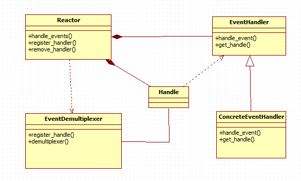

最近自学libevent事件驱动库，参考的资料为libevent2.2版本以及张亮提供的《Libevent源码深度剖析》，参考资料： [http://blog.csdn.net/sparkliang/article/details/4957667](http://blog.csdn.net/sparkliang/article/details/4957667), libevent好处之类的就不赘述了，libevent和libiop，redis等一样都是采用事件回调机制，这种模式被称作Reactor模式。正常事件处理流程是应用程序调用某个接口触发某个功能，而Reactor模式需要我们将这些接口和宿主指针（谁调用这些接口）注册在Reactor，在合适的时机Reactor使用宿主指针调用注册好的回调函数。
## 一： Reactor基本知识

`Reactor 模式是编写高性能网络服务器的必备技术之一`，它具有如下的优点：
`1）响应快`，不必为单个同步时间所阻塞，虽然 Reactor 本身依然是同步的；
`2）编程相对简单`，可以最大程度的避免复杂的多线程及同步问题，并且避免了多线程/进程的切换开销；
`3）可扩展性`，可以方便的通过增加 Reactor 实例个数来充分利用 CPU 资源；
`4）可复用性`， reactor 框架本身与具体事件处理逻辑无关，具有很高的复用性；
Reactor模式框架

<!--more-->
`1） Handle 意思为句柄`，在Linux表示文件描述符，在windows是socket或者handle。

`2）EventDemultiplexer 表示事件多路分发机制`，调用系统提供的I/O多路复用机制，比如select，epoll,程序先将关注的句柄注册到EventDemultiplexer上,当有关注的事件
到来时，触发EventDemultiplexer通知程序，程序调用之前注册好的回调函数完成消息相应。对应到 libevent 中，依然是 select、 poll、 epoll 等，但是 libevent 使用结构体eventop进行了 封装，以统一的接口来支持这些 I/O 多路复用机制，达到了对外隐藏底层系统机制的目的。
`3）Reactor——反应器`
Reactor，是事件管理的接口，内部使用 event demultiplexer 注册、注销事件；并运行事件循环，当有事件进入“就绪”状态时，调用注册事件的回调函数处理事件。
对应到 libevent 中，就是 event_base 结构体。一个典型的Reactor声明方式
``` cpp
class Reactor
{
public:
int register_handler(Event_Handler *pHandler, int event);
int remove_handler(Event_Handler *pHandler, int event);
void handle_events(timeval *ptv);
// ...
};
```
`4） Event Handler——事件处理程序`
事件处理程序提供了一组接口，每个接口对应了一种类型的事件，供 Reactor 在相应的事件发生时调用，执行相应的事件处理。通常它会绑定一个有效的句柄。
对应到 libevent 中，就是 event 结构体。下面是两种典型的 Event Handler 类声明方式， 二者互有优缺点。

``` cpp
class Event_Handler
{
public:
virtual void handle_read() = 0;
virtual void handle_write() = 0;
virtual void handle_timeout() = 0;
virtual void handle_close() = 0;
virtual HANDLE get_handle() = 0;
// ...
};
class Event_Handler
{
public:
// events maybe read/write/timeout/close .etc
virtual void handle_events(int events) = 0;
virtual HANDLE get_handle() = 0;
// ...
};
```
## 二：如何使用libevent库提供的API

`1）首先初始化 libevent 库，并保存返回的指针struct event_base * base = event_init();`
实际上这一步相当于初始化一个 Reactor 实例；在初始化 libevent 后，就可以注册事件了。

`2）设置event属性和回调函数`

调用函数void event_set(struct event *ev, int fd, short event, void (*cb)(int,
short, void *), void *arg);

每个参数的意义：

`ev：执行要初始化的 event 对象`；
`fd：该 event 绑定的“句柄”，对于信号事件，它就是关注的信号`；
`event：在该 fd 上关注的事件类型，它可以是 EV_READ, EV_WRITE, EV_SIGNAL`；
`cb：这是一个函数指针`，当 fd 上的事件 event 发生时，调用该函数执行处理，它有三个参数，分别是关注的fd, 关注的事件类型（读/写/信号），回调函数的参数void* arg，调用时由event_base 负责传入，按顺序，实际上就是 event_set 时的 fd, event 和 arg；

`arg：传递给 cb 函数指针的参数`；

由于定时事件不需要 fd，并且定时事件是根据添加时（ event_add）的超时值设定的，因此这里 event 也不需要设置。
这一步相当于初始化一个 event handler，在 libevent 中事件类型保存在 event 结构体中。
注意： libevent 并不会管理 event 事件集合，这需要应用程序自行管理；

`3）设置 event 从属的 event_base`
event_base_set(base, &ev);
这一步相当于指明 event 要注册到哪个 event_base 实例上；


`4）将事件添加到事件队列里`
event_add(&ev, timeout);
基本信息都已设置完成，只要简单的调用 event_add()函数即可完成，其中 timeout 是定时值；

这一步相当于调用` Reactor::register_handler()`函数注册事件。


`5）程序进入无限循环，等待就绪事件并执行事件处理`
event_base_dispatch(base);

看一下libevent提供的sample
``` cpp
int
main(int argc, char **argv)
{
    struct event evfifo;
#ifdef WIN32
    HANDLE socket;
    /* Open a file. */
    socket = CreateFileA("test.txt",    /* open File */
            GENERIC_READ,        /* open for reading */
            0,            /* do not share */
            NULL,            /* no security */
            OPEN_EXISTING,        /* existing file only */
            FILE_ATTRIBUTE_NORMAL,    /* normal file */
            NULL);            /* no attr. template */

    if (socket == INVALID_HANDLE_VALUE)
        return 1;

#else
    struct stat st;
    const char *fifo = "event.fifo";
    int socket;

    if (lstat(fifo, &st) == 0) {
        if ((st.st_mode & S_IFMT) == S_IFREG) {
            errno = EEXIST;
            perror("lstat");
            exit(1);
        }
    }

    unlink(fifo);
    if (mkfifo(fifo, 0600) == -1) {
        perror("mkfifo");
        exit(1);
    }

    /* Linux pipes are broken, we need O_RDWR instead of O_RDONLY */
#ifdef __linux
    socket = open(fifo, O_RDWR | O_NONBLOCK, 0);
#else
    socket = open(fifo, O_RDONLY | O_NONBLOCK, 0);
#endif

    if (socket == -1) {
        perror("open");
        exit(1);
    }

    fprintf(stderr, "Write data to %s\n", fifo);
#endif
    /* Initalize the event library */
    event_init();

    /* Initalize one event */
#ifdef WIN32
    event_set(&evfifo, (evutil_socket_t)socket, EV_READ, fifo_read, &evfifo);
#else
    event_set(&evfifo, socket, EV_READ, fifo_read, &evfifo);
#endif

    /* Add it to the active events, without a timeout */
    event_add(&evfifo, NULL);

    event_dispatch();
#ifdef WIN32
    CloseHandle(socket);
#endif
    return (0);
}
```

`main函数里调用event_init()初始化一个event_base`,`之后调用event_set对event设置了回调函数和读事件关注`，`event_add将此事件加入event队列里`，`超时设置为空最后调用event_dispatch()进行事件轮训派发`。fifo_read是一个回调函数，格式就是之前说的cb格式

``` cpp
static void
fifo_read(evutil_socket_t fd, short event, void *arg)
{
    char buf[255];
    int len;
    struct event *ev = arg;
#ifdef WIN32
    DWORD dwBytesRead;
#endif

    /* Reschedule this event */
    event_add(ev, NULL);

    fprintf(stderr, "fifo_read called with fd: %d, event: %d, arg: %p\n",
        (int)fd, event, arg);
#ifdef WIN32
    len = ReadFile((HANDLE)fd, buf, sizeof(buf) - 1, &dwBytesRead, NULL);

    /* Check for end of file. */
    if (len && dwBytesRead == 0) {
        fprintf(stderr, "End Of File");
        event_del(ev);
        return;
    }

    buf[dwBytesRead] = '\0';
#else
    len = read(fd, buf, sizeof(buf) - 1);

    if (len == -1) {
        perror("read");
        return;
    } else if (len == 0) {
        fprintf(stderr, "Connection closed\n");
        return;
    }

    buf[len] = '\0';
#endif
    fprintf(stdout, "Read: %s\n", buf);
}
```
 

## 三：《libevent 代码深度剖析》中对文件组织进行了归类

`1）头文主要就是 event.h：事件宏定义、接口函数声明，主要结构体 event 的声明；`

`2）内部头文件`
xxx-internal.h：内部数据结构和函数，对外不可见，以达到信息隐藏的目的；
`3） libevent 框架`
event.c： event 整体框架的代码实现；
`4）对系统 I/O 多路复用机制的封装`
epoll.c：对 epoll 的封装；
select.c：对 select 的封装；
devpoll.c：对 dev/poll 的封装;
kqueue.c：对 kqueue 的封装；
`5）定时事件管理`
min-heap.h：其实就是一个以时间作为 key 的小根堆结构；
`6）信号管理`
signal.c：对信号事件的处理；
`7）辅助功能函数`
evutil.h 和 evutil.c：一些辅助功能函数，包括创建 socket pair 和一些时间操作函数：加、减
和比较等。
`8）日志`
log.h 和 log.c： log 日志函数
`9）缓冲区管理`
evbuffer.c 和 buffer.c： libevent 对缓冲区的封装；
`10）基本数据结构`
compat\sys 下的两个源文件： queue.h 是 libevent 基本数据结构的实现，包括链表，双向链表，
队列等； _libevent_time.h：一些用于时间操作的结构体定义、函数和宏定义；
`11）实用网络库`

`http 和 evdns：是基于 libevent 实现的 http 服务器和异步 dns 查询库；`

## 四：event结构知识

下面着重看下event结构体，这是libevent核心结构

``` cpp
struct event {
    TAILQ_ENTRY(event) ev_active_next;
    TAILQ_ENTRY(event) ev_next;
    /* for managing timeouts */
    union {
        TAILQ_ENTRY(event) ev_next_with_common_timeout;
        int min_heap_idx;
    } ev_timeout_pos;
    evutil_socket_t ev_fd;

    struct event_base *ev_base;

    union {
        /* used for io events */
        struct {
            TAILQ_ENTRY(event) ev_io_next; 
            struct timeval ev_timeout;
        } ev_io;

        /* used by signal events */
        struct {
            TAILQ_ENTRY(event) ev_signal_next;
            short ev_ncalls;
            /* Allows deletes in callback */
            short *ev_pncalls;
        } ev_signal;
    } _ev;

    short ev_events;
    short ev_res;        /* result passed to event callback */
    short ev_flags;
    ev_uint8_t ev_pri;    /* smaller numbers are higher priority */
    ev_uint8_t ev_closure;
    struct timeval ev_timeout;

    /* allows us to adopt for different types of events */
    void (*ev_callback)(evutil_socket_t, short, void *arg);
    void *ev_arg;
};
```
`ev_active_next： 表示就绪状态的事件链表指针`，当关注的事件就绪后，会把

对应的event放入active的队列里。表示该事件在active队列里的位置

`ev_next：表示所有事件队列链表的指针`。表示该事件在所有时间列表的位置。

`ev_timeout_pos：用于管理超时`

`ev_fd：event绑定的socket描述符`

`ev_events:event关注的事件类型`，它可以是以下3种类型：
`I/O事件： EV_WRITE和EV_READ`
`定时事件： EV_TIMEOUT`
`信号： EV_SIGNAL`
`辅助选项： EV_PERSIST，表明是一个永久事件`

Libevent中的定义为：
``` cpp
#define EV_TIMEOUT 0x01
#define EV_READ 0x02
#define EV_WRITE 0x04
#define EV_SIGNAL 0x08
#define EV_PERSIST 0x10 /* Persistant event */
```
 

`ev_res：记录了当前激活事件的类型`；

`ev_flags： libevent 用于标记 event 信息的字段，表明其当前的状态，可能的值有`：
``` cpp
#define EVLIST_TIMEOUT 0x01 // event在time堆中
#define EVLIST_INSERTED 0x02 // event在已注册事件链表中
#define EVLIST_SIGNAL 0x04 // 未见使用
#define EVLIST_ACTIVE 0x08 // event在激活链表中
#define EVLIST_INTERNAL 0x10 // 内部使用标记
#define EVLIST_INIT 0x80 // event 已被初始化
```

`ev_pri：当前事件的优先级`

`ev_timeout：超时时间设置`

`ev_callback：该事件对应的回调函数，和cb类型一样`

`ev_arg：回调函数用到参数`

`ev_ncalls：事件就绪执行时，调用 ev_callback 的次数，通常为 1`；
`ev_pncalls：指针，通常指向 ev_ncalls 或者为 NULL`；

## 五：libevent对于event的管理和使用

对于event使用流程之前有讲过，需要设置event的属性和回调函数，然后将其加入event队列里。设置event属性和回调函数的api如下
``` cpp
void
event_set(struct event *ev, evutil_socket_t fd, short events,
      void (*callback)(evutil_socket_t, short, void *), void *arg)
{
    int r;
    r = event_assign(ev, current_base, fd, events, callback, arg);
    EVUTIL_ASSERT(r == 0);
}
```
 

`ev：表示event指针`

`fd:event要关注的socket fd`

`events:event关注的事件类型(读写I/O，信号，时间事件等)`

`callback:event就绪后会调用的回调函数`

`arg：调用回调函数时，函数的参数`

该函数内部调用了event_assign完成设置

``` cpp
int
event_assign(struct event *ev, struct event_base *base, evutil_socket_t fd, short events, void (*callback)(evutil_socket_t, short, void *), void *arg)
{
    if (!base)
        base = current_base;

    _event_debug_assert_not_added(ev);

    ev->ev_base = base;

    ev->ev_callback = callback;
    ev->ev_arg = arg;
    ev->ev_fd = fd;
    ev->ev_events = events;
    ev->ev_res = 0;
    ev->ev_flags = EVLIST_INIT;
    ev->ev_ncalls = 0;
    ev->ev_pncalls = NULL;

    if (events & EV_SIGNAL) {
        if ((events & (EV_READ|EV_WRITE)) != 0) {
            event_warnx("%s: EV_SIGNAL is not compatible with "
                "EV_READ or EV_WRITE", __func__);
            return -1;
        }
　　　　//对于信号设置终止信号
        ev->ev_closure = EV_CLOSURE_SIGNAL;
    } else {
        if (events & EV_PERSIST) {
            evutil_timerclear(&ev->ev_io_timeout);
　　　　//永久事件
            ev->ev_closure = EV_CLOSURE_PERSIST;
        } else {
            ev->ev_closure = EV_CLOSURE_NONE;
        }
    }

    min_heap_elem_init(ev);

    if (base != NULL) {
        /* by default, we put new events into the middle priority */
        ev->ev_pri = base->nactivequeues / 2;
    }

    _event_debug_note_setup(ev);

    return 0;
}
```
 
设置好event属性和回调函数后，需要将event设置到指定的event_base中，因为有可能存在很多event_base。调用如下函数

``` cpp
int
event_base_set(struct event_base *base, struct event *ev)
{
    /* Only innocent events may be assigned to a different base */
    if (ev->ev_flags != EVLIST_INIT)
        return (-1);

    _event_debug_assert_is_setup(ev);

    ev->ev_base = base;
    ev->ev_pri = base->nactivequeues/2;

    return (0);
}
```
该函数设置了优先级和隶属于哪个base另外还有一个设置优先级的函数

`int event_priority_set(struct event *ev, int pri)`
设置event ev的优先级，没什么可说的，注意的一点就是：当ev正处于就绪状态时，不能设置，返回-1
 

## 六：event_base结构分析和使用

event_base结构如下
``` cpp
struct event_base {
    /** Function pointers and other data to describe this event_base's
     * backend. */
    const struct eventop *evsel;
    /** Pointer to backend-specific data. */
    void *evbase;

    /** List of changes to tell backend about at next dispatch.  Only used
     * by the O(1) backends. */
    struct event_changelist changelist;

    /** Function pointers used to describe the backend that this event_base
     * uses for signals */
    const struct eventop *evsigsel;
    /** Data to implement the common signal handelr code. */
    struct evsig_info sig;

    /** Number of virtual events */
    int virtual_event_count;
    /** Number of total events added to this event_base */
    int event_count;
    /** Number of total events active in this event_base */
    int event_count_active;

    /** Set if we should terminate the loop once we're done processing
     * events. */
    int event_gotterm;
    /** Set if we should terminate the loop immediately */
    int event_break;
    /** Set if we should start a new instance of the loop immediately. */
    int event_continue;

    /** The currently running priority of events */
    int event_running_priority;

    /** Set if we're running the event_base_loop function, to prevent
     * reentrant invocation. */
    int running_loop;

    /* Active event management. */
    /** An array of nactivequeues queues for active events (ones that
     * have triggered, and whose callbacks need to be called).  Low
     * priority numbers are more important, and stall higher ones.
     */
    struct event_list *activequeues;
    /** The length of the activequeues array */
    int nactivequeues;

    /* common timeout logic */

    /** An array of common_timeout_list* for all of the common timeout
     * values we know. */
    struct common_timeout_list **common_timeout_queues;
    /** The number of entries used in common_timeout_queues */
    int n_common_timeouts;
    /** The total size of common_timeout_queues. */
    int n_common_timeouts_allocated;

    /** List of defered_cb that are active.  We run these after the active
     * events. */
    struct deferred_cb_queue defer_queue;

    /** Mapping from file descriptors to enabled (added) events */
    struct event_io_map io;

    /** Mapping from signal numbers to enabled (added) events. */
    struct event_signal_map sigmap;

    /** All events that have been enabled (added) in this event_base */
    struct event_list eventqueue;

    /** Stored timeval; used to detect when time is running backwards. */
    struct timeval event_tv;

    /** Priority queue of events with timeouts. */
    struct min_heap timeheap;

    /** Stored timeval: used to avoid calling gettimeofday/clock_gettime
     * too often. */
    struct timeval tv_cache;

#if defined(_EVENT_HAVE_CLOCK_GETTIME) && defined(CLOCK_MONOTONIC)
    /** Difference between internal time (maybe from clock_gettime) and
     * gettimeofday. */
    struct timeval tv_clock_diff;
    /** Second in which we last updated tv_clock_diff, in monotonic time. */
    time_t last_updated_clock_diff;
#endif

#ifndef _EVENT_DISABLE_THREAD_SUPPORT
    /* threading support */
    /** The thread currently running the event_loop for this base */
    unsigned long th_owner_id;
    /** A lock to prevent conflicting accesses to this event_base */
    void *th_base_lock;
    /** The event whose callback is executing right now */
    struct event *current_event;
    /** A condition that gets signalled when we're done processing an
     * event with waiters on it. */
    void *current_event_cond;
    /** Number of threads blocking on current_event_cond. */
    int current_event_waiters;
#endif

#ifdef WIN32
    /** IOCP support structure, if IOCP is enabled. */
    struct event_iocp_port *iocp;
#endif

    /** Flags that this base was configured with */
    enum event_base_config_flag flags;

    /* Notify main thread to wake up break, etc. */
    /** True if the base already has a pending notify, and we don't need
     * to add any more. */
    int is_notify_pending;
    /** A socketpair used by some th_notify functions to wake up the main
     * thread. */
    evutil_socket_t th_notify_fd[2];
    /** An event used by some th_notify functions to wake up the main
     * thread. */
    struct event th_notify;
    /** A function used to wake up the main thread from another thread. */
    int (*th_notify_fn)(struct event_base *base);
};
```
`evsel：eventop类型的指针，针对不同的模型封装了同一套操作`

`evbase： 不同模型开辟的数据空间，放到event_base里`。

evbase和evsel配套使用，eventop结构如下
``` cpp
struct eventop {
    /** The name of this backend. */
    const char *name;
    /** Function to set up an event_base to use this backend.  It should
     * create a new structure holding whatever information is needed to
     * run the backend, and return it.  The returned pointer will get
     * stored by event_init into the event_base.evbase field.  On failure,
     * this function should return NULL. */
    void *(*init)(struct event_base *);
    /** Enable reading/writing on a given fd or signal.  'events' will be
     * the events that we're trying to enable: one or more of EV_READ,
     * EV_WRITE, EV_SIGNAL, and EV_ET.  'old' will be those events that
     * were enabled on this fd previously.  'fdinfo' will be a structure
     * associated with the fd by the evmap; its size is defined by the
     * fdinfo field below.  It will be set to 0 the first time the fd is
     * added.  The function should return 0 on success and -1 on error.
     */
    int (*add)(struct event_base *, evutil_socket_t fd, short old, short events, void *fdinfo);
    /** As "add", except 'events' contains the events we mean to disable. */
    int (*del)(struct event_base *, evutil_socket_t fd, short old, short events, void *fdinfo);
    /** Function to implement the core of an event loop.  It must see which
        added events are ready, and cause event_active to be called for each
        active event (usually via event_io_active or such).  It should
        return 0 on success and -1 on error.
     */
    int (*dispatch)(struct event_base *, struct timeval *);
    /** Function to clean up and free our data from the event_base. */
    void (*dealloc)(struct event_base *);
    /** Flag: set if we need to reinitialize the event base after we fork.
     */
    int need_reinit;
    /** Bit-array of supported event_method_features that this backend can
     * provide. */
    enum event_method_feature features;
    /** Length of the extra information we should record for each fd that
        has one or more active events.  This information is recorded
        as part of the evmap entry for each fd, and passed as an argument
        to the add and del functions above.
     */
    size_t fdinfo_len;
};
```
`eventop封装了epoll, select 等不同网络模型的init，add，deldispatch等回调函数`。

`changelist：通知后端改变的列表`。

`evsigsel：告诉后台 eventbase用于处理signal事件的函数指针`

`event_count：eventbase中总共的event数量`

`event_count_active： eventbase中激活的event数量`

`event_gotterm：这个参数设置后，一旦我们对事件做了处理，就要终止循环。`

`event_break：立刻结束循环`

`event_continue：立刻开启一个新的循环实例`

`event_running_priority：当前事件队列的优先级。`

`activequeues：激活的事件队列，priority数字小的先触发。`

`struct event_io_map io： 用于管理io事件的描述符`

`struct event_signal_map sigmap： 用于管理signal的描述符`

`eventqueue：所有被加入event_base的事件组成的队列`

`event_tv：后台记录运行的时间`

`timeheap：用小根堆管理超时事件队列`

 其他的参数不是很了解，以后用到了再琢磨。

`libevent提供如下两个函数可以生成eventbase实例`

``` cpp
event_init(void)
{
    struct event_base *base = event_base_new_with_config(NULL);

    if (base == NULL) {
        event_errx(1, "%s: Unable to construct event_base", __func__);
        return NULL;
    }

    current_base = base;

    return (base);
}

struct event_base *
event_base_new(void)
{
    struct event_base *base = NULL;
    struct event_config *cfg = event_config_new();
    if (cfg) {
        base = event_base_new_with_config(cfg);
        event_config_free(cfg);
    }
    return base;
}
```
到此为止基本的结构介绍完了。
## 七libevent事件添加/删除/初始化/派发接口分析

`1 event_base初始化和模型初始化`

先看下初始化，`实际上初始化是在event_base_new_with_config函数`中完成的。
``` cpp
struct event_base *
event_base_new_with_config(const struct event_config *cfg)
{
    ...
　　 base->evsel = eventops[i];
    base->evbase = base->evsel->init(base);
    ...
}    
```
`event_init和eventbase_new都会调用event_base_new_with_config这个函数`.

`而base->evsel是不同模型的指针，进而实现调用不同模型的init`

`2 事件添加注册函数`

``` cpp
int
event_add(struct event *ev, const struct timeval *tv)
{
    int res;

    if (EVUTIL_FAILURE_CHECK(!ev->ev_base)) {
        event_warnx("%s: event has no event_base set.", __func__);
        return -1;
    }

    EVBASE_ACQUIRE_LOCK(ev->ev_base, th_base_lock);

    res = event_add_internal(ev, tv, 0);

    EVBASE_RELEASE_LOCK(ev->ev_base, th_base_lock);

    return (res);
}
```

`防止多线程访问出错，加了锁，并且调用了`

``` cpp
static inline int
event_add_internal(struct event *ev, const struct timeval *tv,
    int tv_is_absolute)
{
    struct event_base *base = ev->ev_base;
    int res = 0;
    int notify = 0;
 
    ...
    /*
     * 新的timer事件，调用timer heap接口在堆上预留一个位置
　　 *向系统I/O机制注册可能会失败，而当在堆上预留成功后，
    * 定时事件的添加将肯定不会失败；

    */
    if (tv != NULL && !(ev->ev_flags & EVLIST_TIMEOUT)) {
        if (min_heap_reserve(&base->timeheap,
            1 + min_heap_size(&base->timeheap)) == -1)
            return (-1);  /* ENOMEM == errno */
    }

    //根据不同的事件（IO，信号，超时事件等将fd放入不同的map
    if ((ev->ev_events & (EV_READ|EV_WRITE|EV_SIGNAL)) &&
        !(ev->ev_flags & (EVLIST_INSERTED|EVLIST_ACTIVE))) {
        if (ev->ev_events & (EV_READ|EV_WRITE))
            res = evmap_io_add(base, ev->ev_fd, ev);
        else if (ev->ev_events & EV_SIGNAL)
            res = evmap_signal_add(base, (int)ev->ev_fd, ev);
        if (res != -1)
           //将event放入事件队列
            event_queue_insert(base, ev, EVLIST_INSERTED);
        if (res == 1) {
            /* evmap says we need to notify the main thread. */
            notify = 1;
            res = 0;
        }
    }

    /*
         EVLIST_TIMEOUT表明event已经在定时器堆中了，删除旧的
         */
        if (ev->ev_flags & EVLIST_TIMEOUT) {
            /* XXX I believe this is needless. */
            if (min_heap_elt_is_top(ev))
                notify = 1;
            event_queue_remove(base, ev, EVLIST_TIMEOUT);
        }

        /* // 如果事件已经是就绪状态则从激活链表中删除 */
        if ((ev->ev_flags & EVLIST_ACTIVE) &&
            (ev->ev_res & EV_TIMEOUT)) {
            if (ev->ev_events & EV_SIGNAL) {
                /* See if we are just active executing
                 * this event in a loop
                 */
                if (ev->ev_ncalls && ev->ev_pncalls) {
                    /* Abort loop */
                    *ev->ev_pncalls = 0;
                }
            }

            event_queue_remove(base, ev, EVLIST_ACTIVE);
        }

        gettime(base, &now);

       ...       // 计算时间，并插入到timer小根堆中
        event_queue_insert(base, ev, EVLIST_TIMEOUT);
        return (res);
}
```
`在evmap_io_add里完成了io事件对于不同网络模型(select/epoll等)的绑定`

``` cpp
int
evmap_io_add(struct event_base *base, evutil_socket_t fd, struct event *ev)
{
     ...
     const struct eventop *evsel = base->evsel;
     struct event_io_map *io = &base->io;
     ...
     //将event的fd和类型注册到不同的网络模型
     if (evsel->add(base, ev->ev_fd,
            old, (ev->ev_events & EV_ET) | res, extra) == -1)
            return (-1);
     ...
   
}
```
`event_queue_insert()负责将事件插入到对应的链表中`；
`event_queue_remove()负责将事件从对应的链表中删除`；
``` cpp
void event_queue_insert(struct event_base *base, struct event *ev,
int queue)
{
    // ev可能已经在激活列表中了，避免重复插入
    if (ev->ev_flags & queue) {
    if (queue & EVLIST_ACTIVE)
    return;
    }
    // // 记录queue标记
    ev->ev_flags |= queue;
    switch (queue) {
         // I/O或Signal事件，加入已注册事件链表
        case EVLIST_INSERTED:
        TAILQ_INSERT_TAIL(&base->eventqueue, ev, ev_next);
        break;
        // 就绪事件，加入激活链表
        case EVLIST_ACTIVE: 
        base->event_count_active++;
        TAILQ_INSERT_TAIL(base->activequeues[ev->ev_pri], ev,
        ev_active_next);
        break;
        // 定时事件，加入堆
        case EVLIST_TIMEOUT: 
        min_heap_push(&base->timeheap, ev);
        break;
    }
}
                                          
```
`3删除事件`

``` cpp
int
event_del(struct event *ev)
{
    int res;

    if (EVUTIL_FAILURE_CHECK(!ev->ev_base)) {
        event_warnx("%s: event has no event_base set.", __func__);
        return -1;
    }

    EVBASE_ACQUIRE_LOCK(ev->ev_base, th_base_lock);

    res = event_del_internal(ev);

    EVBASE_RELEASE_LOCK(ev->ev_base, th_base_lock);

    return (res);
}
```
内部调用了

``` cpp
static inline int
event_del_internal(struct event *ev)
{
    struct event_base *base;
    int res = 0, notify = 0;

    event_debug(("event_del: %p (fd "EV_SOCK_FMT"), callback %p",
        ev, EV_SOCK_ARG(ev->ev_fd), ev->ev_callback));

    /* An event without a base has not been added */
    if (ev->ev_base == NULL)
        return (-1);

  
    base = ev->ev_base;


    EVUTIL_ASSERT(!(ev->ev_flags & ~EVLIST_ALL));
    //根据不同flag从队列中移除
    if (ev->ev_flags & EVLIST_TIMEOUT) {
        /* NOTE: We never need to notify the main thread because of a
         * deleted timeout event: all that could happen if we don't is
         * that the dispatch loop might wake up too early.  But the
         * point of notifying the main thread _is_ to wake up the
         * dispatch loop early anyway, so we wouldn't gain anything by
         * doing it.
         */
        event_queue_remove(base, ev, EVLIST_TIMEOUT);
    }

    if (ev->ev_flags & EVLIST_ACTIVE)
        event_queue_remove(base, ev, EVLIST_ACTIVE);

    if (ev->ev_flags & EVLIST_INSERTED) {
        event_queue_remove(base, ev, EVLIST_INSERTED);
        if (ev->ev_events & (EV_READ|EV_WRITE))
           //io事件从map中移除
            res = evmap_io_del(base, ev->ev_fd, ev);
        else
            res = evmap_signal_del(base, (int)ev->ev_fd, ev);
        if (res == 1) {
            /* evmap says we need to notify the main thread. */
            notify = 1;
            res = 0;
        }
    }return (res);
}
```
evmap_io_del 中完成了不同模型del函数调用

``` cpp
int
evmap_io_del(struct event_base *base, evutil_socket_t fd, struct event *ev)
{

    if (evsel->del(base, ev->ev_fd, old, res, extra) == -1)
            return (-1);

}
```
 
`4 事件派发`

``` cpp
int
event_base_loop(struct event_base *base, int flags)

{
    const struct eventop *evsel = base->evsel;
    struct timeval tv;
    struct timeval *tv_p;
    int res, done, retval = 0;

   while (!done) {
        base->event_continue = 0;

        /* Terminate the loop if we have been asked to */

　　　　//设置了event_gotterm或者event_break都会导致break
        if (base->event_gotterm) {
            break;
        }

        if (base->event_break) {
            break;
        }
        //校正系统时间
        timeout_correct(base, &tv);
        // 根据timer heap中事件的最小超时时间，计算系统I/O demultiplexer
         //的最大等待时间
        tv_p = &tv;
        if (!N_ACTIVE_CALLBACKS(base) && !(flags & EVLOOP_NONBLOCK)) {
            timeout_next(base, &tv_p);
        } else {
            /*
             * 如果有激活的事件，我们立即处理，不用等待
             */
            evutil_timerclear(&tv);
        }

        /* If we have no events, we just exit */
        if (!event_haveevents(base) && !N_ACTIVE_CALLBACKS(base)) {
            event_debug(("%s: no events registered.", __func__));
            retval = 1;
            goto done;
        }

        /* update last old time */
        gettime(base, &base->event_tv);

        clear_time_cache(base);
        //完成事件的派发，将就绪的事件放倒active列表里
        res = evsel->dispatch(base, tv_p);

        if (res == -1) {
            event_debug(("%s: dispatch returned unsuccessfully.",
                __func__));
            retval = -1;
            goto done;
        }

        update_time_cache(base);

        timeout_process(base);
　　　　// 调用event_process_active()处理激活链表中的就绪event，调用其
       //回调函数执行事件处理
      // 该函数会寻找最高优先级（priority值越小优先级越高）的激活事件
      //链表，
      // 然后处理链表中的所有就绪事件；
      // 因此低优先级的就绪事件可能得不到及时处理；
        if (N_ACTIVE_CALLBACKS(base)) {
            int n = event_process_active(base);
            if ((flags & EVLOOP_ONCE)
                && N_ACTIVE_CALLBACKS(base) == 0
                && n != 0)
                done = 1;
        } else if (flags & EVLOOP_NONBLOCK)
            done = 1;
    }
    event_debug(("%s: asked to terminate loop.", __func__));

done:
    clear_time_cache(base);
    base->running_loop = 0;

    EVBASE_RELEASE_LOCK(base, th_base_lock);

    return (retval);
}
```

`调用evsel->dispatch后将事件放入active队列,然后process_active处理激活队列里的事件`
``` cpp
static int
event_process_active(struct event_base *base)
{
    /* Caller must hold th_base_lock */
    struct event_list *activeq = NULL;
    int i, c = 0;

    for (i = 0; i < base->nactivequeues; ++i) {
        if (TAILQ_FIRST(&base->activequeues[i]) != NULL) {
            base->event_running_priority = i;
            activeq = &base->activequeues[i];
            c = event_process_active_single_queue(base, activeq);
            if (c < 0) {
                base->event_running_priority = -1;
                return -1;
            } else if (c > 0)
                break; /* Processed a real event; do not
                    * consider lower-priority events */
            /* If we get here, all of the events we processed
             * were internal.  Continue. */
        }
    }

    event_process_deferred_callbacks(&base->defer_queue,&base->event_break);
    base->event_running_priority = -1;
    return c;
}
```
`优先级数字base->nactivequeues 以下的会被先处理`。到目前为止介绍了libevent库的基本api和流程。`对于不同的网络模型libevent是如何封装的呢？`

## 八libevent对于网络模型的封装(epoll为例)

`epoll基本单元封装`
``` cpp
struct epollop {
    struct epoll_event *events;
    int nevents;
    int epfd;
};
```
`epfd：epoll_create 返回的epoll表句柄`

`events: 表示epoll表监听的epoll_event 队列`

`nevents:epoll_event队列大小`

在介绍epoll封装的一些接口前，先看以下两个结构体定义的对象

``` cpp
static const struct eventop epollops_changelist = {
    "epoll (with changelist)",
    epoll_init,
    event_changelist_add,
    event_changelist_del,
    epoll_dispatch,
    epoll_dealloc,
    1, /* need reinit */
    EV_FEATURE_ET|EV_FEATURE_O1,
    EVENT_CHANGELIST_FDINFO_SIZE
};
```
结构体对象封装了epoll操作的函数指针，

`event_changelist_add表示设置changlist标记位时将事件加入changelist`

`event_changelist_del表示如果设置了changelist标记位事件从changelist中移除。`

``` cpp
const struct eventop epollops = {
    "epoll",
    epoll_init,
    epoll_nochangelist_add,
    epoll_nochangelist_del,
    epoll_dispatch,
    epoll_dealloc,
    1, /* need reinit */
    EV_FEATURE_ET|EV_FEATURE_O1,
    0
};
```
这个结构体对象对应的是没设置changelist标记位时epoll的操作接口接下来看下epoll_init函数

``` cpp
epoll_init(struct event_base *base)
{
    int epfd;
    struct epollop *epollop;

    /* Initialize the kernel queue.  (The size field is ignored since
     * 2.6.8.) */
    if ((epfd = epoll_create(32000)) == -1) {
        if (errno != ENOSYS)
            event_warn("epoll_create");
        return (NULL);
    }

    evutil_make_socket_closeonexec(epfd);

    if (!(epollop = mm_calloc(1, sizeof(struct epollop)))) {
        close(epfd);
        return (NULL);
    }

    epollop->epfd = epfd;

    /* Initialize fields */
    epollop->events = mm_calloc(INITIAL_NEVENT, sizeof(struct epoll_event));
    if (epollop->events == NULL) {
        mm_free(epollop);
        close(epfd);
        return (NULL);
    }
    epollop->nevents = INITIAL_NEVENT;
    //如果设置了EVENT_BASE_FLAG_EPOLL_USE_CHANGELIST
    //添加和删除事件的回调函数变为changelist_add 和changelist_del

    if ((base->flags & EVENT_BASE_FLAG_EPOLL_USE_CHANGELIST) != 0 ||
        ((base->flags & EVENT_BASE_FLAG_IGNORE_ENV) == 0 &&
        evutil_getenv("EVENT_EPOLL_USE_CHANGELIST") != NULL))
        base->evsel = &epollops_changelist;

    evsig_init(base);

    return (epollop);
}
```
接下来看下`epoll封装的事件注册接口，只看epoll_nochangelist_add`，epoll_changelist_add都是类似的。

``` cpp
static int
epoll_nochangelist_add(struct event_base *base, evutil_socket_t fd,
    short old, short events, void *p)
{
    struct event_change ch;
    ch.fd = fd;
    ch.old_events = old;
    ch.read_change = ch.write_change = 0;
    if (events & EV_WRITE)
        ch.write_change = EV_CHANGE_ADD |
            (events & EV_ET);
    if (events & EV_READ)
        ch.read_change = EV_CHANGE_ADD |
            (events & EV_ET);

    return epoll_apply_one_change(base, base->evbase, &ch);
}
```
`在epoll_apply_one_change中完成事件添加`
``` cpp
static int
epoll_apply_one_change(struct event_base *base,
    struct epollop *epollop,
    const struct event_change *ch)
{
    struct epoll_event epev;
    int op, events = 0;

    if (1) {
        
        if ((ch->read_change & EV_CHANGE_ADD) ||
            (ch->write_change & EV_CHANGE_ADD)) {
           
            events = 0;
            op = EPOLL_CTL_ADD;
             //关注读事件
            if (ch->read_change & EV_CHANGE_ADD) {
                events |= EPOLLIN;
            } else if (ch->read_change & EV_CHANGE_DEL) {
                ;
            } else if (ch->old_events & EV_READ) {
                events |= EPOLLIN;
            }
            //关注写事件
            if (ch->write_change & EV_CHANGE_ADD) {
                events |= EPOLLOUT;
            } else if (ch->write_change & EV_CHANGE_DEL) {
                ;
            } else if (ch->old_events & EV_WRITE) {
                events |= EPOLLOUT;
            }
            //设置et模型
            if ((ch->read_change|ch->write_change) & EV_ET)
                events |= EPOLLET;
            //之前有事件关注，将操作改为EPOLL_CTL_MOD
            if (ch->old_events) {
              
                op = EPOLL_CTL_MOD;
            }
        } else if ((ch->read_change & EV_CHANGE_DEL) ||
            (ch->write_change & EV_CHANGE_DEL)) {
          
            op = EPOLL_CTL_DEL;
            //之前关注过删除该事件
            if (ch->read_change & EV_CHANGE_DEL) {
                if (ch->write_change & EV_CHANGE_DEL) {
                   //读写事件都设置删除标记
                    events = EPOLLIN|EPOLLOUT;
                } else if (ch->old_events & EV_WRITE) {
                    events = EPOLLOUT;
                    //只有写事件要求删除，那么更改为读事件
                    op = EPOLL_CTL_MOD;
                } else {
                    //只删除读事件
                    events = EPOLLIN;
                }
            } else if (ch->write_change & EV_CHANGE_DEL) {
                if (ch->old_events & EV_READ) {
                    events = EPOLLIN;
                    //更改为关注读事件
                    op = EPOLL_CTL_MOD;
                } else {
                   //只删除写事件
                    events = EPOLLOUT;
                }
            }
        }

        if (!events)
            return 0;

        memset(&epev, 0, sizeof(epev));
        epev.data.fd = ch->fd;
        epev.events = events;
        //调用epoll_ctl设置event进入epoll监听队列
        if (epoll_ctl(epollop->epfd, op, ch->fd, &epev) == -1) {
            if (op == EPOLL_CTL_MOD && errno == ENOENT) {
             
                if (epoll_ctl(epollop->epfd, EPOLL_CTL_ADD, ch->fd, &epev) == -1) {
                    event_warn("Epoll MOD(%d) on %d retried as ADD; that failed too",
                        (int)epev.events, ch->fd);
                    return -1;
                } else {
                    event_debug(("Epoll MOD(%d) on %d retried as ADD; succeeded.",
                        (int)epev.events,
                        ch->fd));
                }
            } else if (op == EPOLL_CTL_ADD && errno == EEXIST) {
              
                if (epoll_ctl(epollop->epfd, EPOLL_CTL_MOD, ch->fd, &epev) == -1) {
                    event_warn("Epoll ADD(%d) on %d retried as MOD; that failed too",
                        (int)epev.events, ch->fd);
                    return -1;
                } else {
                    event_debug(("Epoll ADD(%d) on %d retried as MOD; succeeded.",
                        (int)epev.events,
                        ch->fd));
                }
            } else if (op == EPOLL_CTL_DEL &&
                (errno == ENOENT || errno == EBADF ||
                errno == EPERM)) {
              
                event_debug(("Epoll DEL(%d) on fd %d gave %s: DEL was unnecessary.",
                    (int)epev.events,
                    ch->fd,
                    strerror(errno)));
            } else {
                event_warn("Epoll %s(%d) on fd %d failed.  Old events were %d; read change was %d (%s); write change was %d (%s)",
                    epoll_op_to_string(op),
                    (int)epev.events,
                    ch->fd,
                    ch->old_events,
                    ch->read_change,
                    change_to_string(ch->read_change),
                    ch->write_change,
                    change_to_string(ch->write_change));
                return -1;
            }
        } else {
            event_debug(("Epoll %s(%d) on fd %d okay. [old events were %d; read change was %d; write change was %d]",
                epoll_op_to_string(op),
                (int)epev.events,
                (int)ch->fd,
                ch->old_events,
                ch->read_change,
                ch->write_change));
        }
    }
    return 0;
}
```
`删除事件也是类似的，内部调用epoll_apply_onechange知识将事件标记位EV_CHANGE_DEL,到函数内部解析为epoll_del或者epoll_mod`
``` cpp
static int
epoll_nochangelist_del(struct event_base *base, evutil_socket_t fd,
    short old, short events, void *p)
{
    struct event_change ch;
    ch.fd = fd;
    ch.old_events = old;
    ch.read_change = ch.write_change = 0;
    if (events & EV_WRITE)
        ch.write_change = EV_CHANGE_DEL;
    if (events & EV_READ)
        ch.read_change = EV_CHANGE_DEL;

    return epoll_apply_one_change(base, base->evbase, &ch);
}
```
最后是事件派发
``` cpp
static int
epoll_dispatch(struct event_base *base, struct timeval *tv)
{
    struct epollop *epollop = base->evbase;
    struct epoll_event *events = epollop->events;
    int i, res;
    long timeout = -1;

    if (tv != NULL) {
        timeout = evutil_tv_to_msec(tv);
        if (timeout < 0 || timeout > MAX_EPOLL_TIMEOUT_MSEC) {
            /* Linux kernels can wait forever if the timeout is
             * too big; see comment on MAX_EPOLL_TIMEOUT_MSEC. */
            timeout = MAX_EPOLL_TIMEOUT_MSEC;
        }
    }
    
    //处理changelis列表的所有事件
    epoll_apply_changes(base);
    event_changelist_remove_all(&base->changelist, base);

    EVBASE_RELEASE_LOCK(base, th_base_lock);

    //处理epoll_wait返回就绪描述符个数
    res = epoll_wait(epollop->epfd, events, epollop->nevents, timeout);

    EVBASE_ACQUIRE_LOCK(base, th_base_lock);

    if (res == -1) {
        if (errno != EINTR) {
            event_warn("epoll_wait");
            return (-1);
        }

        return (0);
    }

    event_debug(("%s: epoll_wait reports %d", __func__, res));
    EVUTIL_ASSERT(res <= epollop->nevents);

    for (i = 0; i < res; i++) {
        int what = events[i].events;
        short ev = 0;

        if (what & (EPOLLHUP|EPOLLERR)) {
            ev = EV_READ | EV_WRITE;
        } else {
            if (what & EPOLLIN)
                ev |= EV_READ;
            if (what & EPOLLOUT)
                ev |= EV_WRITE;
        }

        if (!ev)
            continue;
        //将event放入active队列中
        evmap_io_active(base, events[i].data.fd, ev | EV_ET);
    }

    //epoll就绪数量等于队列长度，额外开辟空间确保新的事件可以触发
    if (res == epollop->nevents && epollop->nevents < MAX_NEVENT) {
        /* We used all of the event space this time.  We should
           be ready for more events next time. */
        int new_nevents = epollop->nevents * 2;
        struct epoll_event *new_events;

        new_events = mm_realloc(epollop->events,
            new_nevents * sizeof(struct epoll_event));
        if (new_events) {
            epollop->events = new_events;
            epollop->nevents = new_nevents;
        }
    }

    return (0);
}
```
以上就是livevent对于epoll的基本封装。整个结构体对象epollops在event.c中被赋值给eventops[]的
``` cpp
static const struct eventop *eventops[] = {
#ifdef _EVENT_HAVE_EVENT_PORTS
    &evportops,
#endif
#ifdef _EVENT_HAVE_WORKING_KQUEUE
    &kqops,
#endif
#ifdef _EVENT_HAVE_EPOLL
    &epollops,
#endif
#ifdef _EVENT_HAVE_DEVPOLL
    &devpollops,
#endif
#ifdef _EVENT_HAVE_POLL
    &pollops,
#endif
#ifdef _EVENT_HAVE_SELECT
    &selectops,
#endif
#ifdef WIN32
    &win32ops,
#endif
    NULL
};
```
之后在event_base_new_with_config中调用base->evsel = eventops[i];完成不同模型的结构体对象赋值给base的evsel指针的。

目前对于libevent的分析和理解先告一段落，以后会更新对libevent的更深刻认识。

