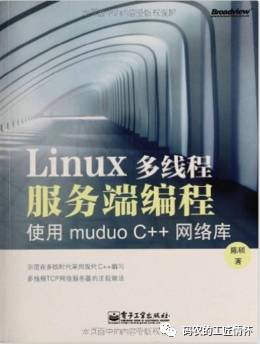
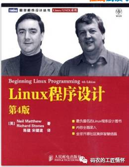
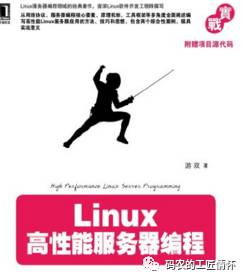
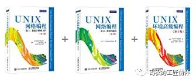
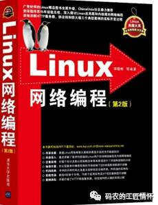

从事`网络编程`有五年多了，写过自己的Server，读过大部分网络库`libevent`，`redis`,`muduo`等等，市面上的网络用书大多读过，给新人一些建议，主要是从事服务器网络编程后端的同学。如果你没写过网络编程的代码，也没有这方面的知识，那么该如何下手呢？这个时候不需要盲目看书，先培养一下自己的兴趣，了解TCP如何建立连接，`TCP三次握手`和`四次握手`的过程，<!--more-->有了这个，然后去了解socket方面编程的基本知识，socket的创建，绑定，连接，发送，接收，建立连接等api，学习完这些api，试着去写一个`单线程阻塞通信` demo，客户端发送数据，服务器接收数据，然后将数据返回给客户端，客户端收到后继续发送，这样简单的`echo服务器`就写出来了。

这是我做的一个小demo，可以参考下，但是不是echo，读者可自己改为echo服务器。

[http://www.cnblogs.com/secondtonone1/p/5460942.html](http://www.cnblogs.com/secondtonone1/p/5460942.html)

如果很多个客户端连接过来怎么处理呢？这时需要了解多线程模式的网络编程，你可以去了解accept原理，和线程创建处理新的连接。这样就可以做出一个多线程echo的Server了。
这是我做的一个简单的accept多线程服务器，读者可自己改为echo模式

[http://www.cnblogs.com/secondtonone1/p/5461120.html](http://www.cnblogs.com/secondtonone1/p/5461120.html)

有了这些基础知识，你就可以深入了解网络变成了，下一步要做的是了解TCP的socket缓存原理，阻塞原理，非阻塞的socket如何返回错误码，错误码的意义和如何处理，这些知识是你学习非阻塞多路复用的基础，学完这些，可以学多路复用的几种模型了，select，poll，epoll，iocp，kqueue等等，学的时候去补充自己不知道的一些TCP知识。多路复用学习后可以简单的去写一些多路复用服务器demo。

这是我之前讲过的epoll知识和自己写的epoll demo

[http://www.cnblogs.com/secondtonone1/p/5367495.html](http://www.cnblogs.com/secondtonone1/p/5367495.html)

[http://www.cnblogs.com/secondtonone1/p/5432453.html](http://www.cnblogs.com/secondtonone1/p/5432453.html)

 
会写多路复用服务器就可以了吗？这只是开始，下面就要阅读源码和高性能的框架了，我推荐去读一读redis和libevent这两个框架，对网络编程提升很大，其中的缓存思想也很重要。这个时候你需要的是从框架的角度搭建一个高性能的服务器，需要了解事件堆，Reactor模式，Proactor模式，将不同的多路复用封装为一个IOService，就像libevent的EventLoop，像boost asio的ioservice一样。

下面是我封装的一个服务器，上传到github了

[https://github.com/secondtonone1/betternet](https://github.com/secondtonone1/betternet)

这些都会了，也就是我现在的水平了，我现在在看一些网络大神的思想和视频，从他们的设计角度感受如何架构一个优秀的框架，建议大家看看陈硕的muduo网络库和编程视频，能醍醐灌顶。我现在也在学一些其他的框架，主要是想触类旁通，同时看看优秀的框架代码，虽然自己写不出太优秀的框架，至少可以开阔眼界，作为积累。

下面是推荐大家的网络图书：

我推荐新手先看

Linux程序设计(第4版) 

Linux高性能服务器编程 

看过之后再看Richard的三本网络书

这些都看过之后，需要实战，实战过程中可以看看

以及陈硕的经验之谈，我现在在看的

这些都看过了，可以看看源码

 libevent 源码下载地址：[http://libevent.org/](http://libevent.org/)

 redis源码下载地址：[http://www.redis.cn/download.html](http://www.redis.cn/download.html)

 boost asio 文档和下载：[http://www.boost.org/doc/libs/1_63_0/doc/html/boost_asio.html](http://www.boost.org/doc/libs/1_63_0/doc/html/boost_asio.html)

 muduo网络库：[http://code.csdn.net/openkb/p-muduo](http://code.csdn.net/openkb/p-muduo)

 
这些源码都搞通了，就有了自己的方法和框架了，然后就自己闯荡吧。 