最近自己的服务器做到`序列化`这一步了，在网上看了下，序列化的工具有`boost `和google的`protocol buffer`，protocol buffer的效率和使用程度更高效一些，就自己琢磨下把他加到自己的服务器里。所以这里我先弄一个小的demo去测试如何使用和配置protocol buffer。首先是windows 平台

## windows下protocol buffer 配置：

1.  下载protocol buffer， 去google官网或者其他渠道下载protocol buffer包

2.  解压zip文件，进入vs文件夹编译protocol buffer，图示如下
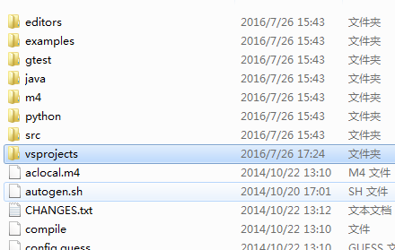
<!-- more -->
3.  工程下的几个项目都编译一遍，会生成几个lib
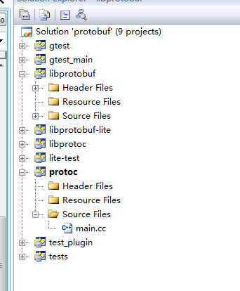
在vs目录下的debug目录里能看到
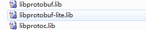
protoc.exe 和 libprotobuf.lib,  libprotobuf-lite.lib , libprotoc.lib这几个lib是新生成的，先放一放，以后会用到。到此为止，google protocol buffer的配置和库已经生成，我们下一步设计自己的proto文件，并生成对应的pb.h和pb.cc  
4. 编写自己的proto 格式如下  
``` cpp
package smart;

message test
{
    required string name = 1;  
    required int32 age = 2;  
    optional string email = 3;  

}
```
package 表示声明为包名，package smart;表示包名为smart, message test定义一个消息体，花括号结束不需要分号,括号内是成员变量，成员变量后面的数字默认从1开始，依次递增。 required表示这个字段必须有，optional表示字段可选，还有一些repeated表示可重复的值域，常用于数组。  
总结下：
数据结构体：  
　　message message_name{message_body;}    
    message_body格式：  
    例如
　　required int32 query = 1[defaut=10]; 
　　形式为：rule type name = value[other_rule]; 规则： 
　　required表示必须具有该值域； 
　　optional表示可选的值域； 
　　repeated表示可重复的值域(即>=0)； 
　　其中requered/optional是常用rule，而repeated则不常用同时因为是历史遗留现使用repeated int32 samples=4[packed=true];形式； 
　　value值： 
　　value值最小为1，是底层编码时使用其中1-15占一位，>15则会占多位； 
　　不同的message中的value值互不干扰,常以1开始计数。  

5. 保存为包名.消息名.proto的形式，我保存为smart.msg.proto  

6. 接下来进行编译这个smart.msg.proto， protobuf提供了protoc命令  

protoc --proto_path=(.proto文件路径) --cpp_out=(.cc .java生成文件路径) (.proto文件路径)/?.proto  

--proto_path 简化为: -I   

其中可根据需要更改:cpp_out选项为java_out/python_out。  

举例： protoc -I=./ --cpp_out=./ ./smart.msg.proto

windows环境下打开cmd，进入到protocol buf vs目录里debug文件夹里调用protoc命令

我的proto放在D:\win32projects\protobuftest\ProtoBuf目录，所以如下：
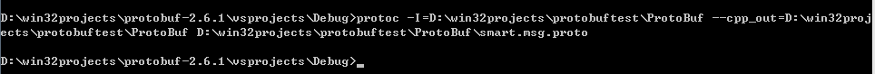
进入D:\win32projects\protobuftest\ProtoBuf下可看到新生成的文件
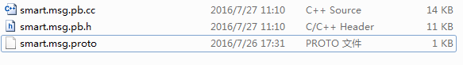
到目前为止，准备工作都做完了，下一步建立自己的项目，使用这些.h和.cc

7. 建立vs项目，我命名为protobuftest，在项目目录里建立Include和Lib，Protobuf  

   文件夹，将protobuff库的src文件夹拷贝到Include里，将libprotobuf.lib,  

   libprotobuf-lite.lib , libprotoc.lib拷贝到Lib文件里，将smart.msg.proto拷贝到Protobuf中，

   将protobuff库的那个debug也拷贝到Protobuf中，因为我想通过写一个批处理文件在该项目

   里生成.h和.cc文件。  

Lib文件夹:  
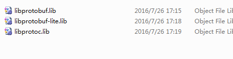

Include文件夹：
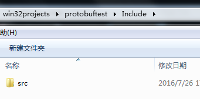

Protobuf文件夹：
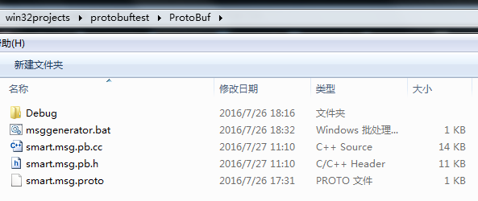
bat如下：
``` bat
cd .\Debug
protoc -I=..\ --cpp_out=..\ ..\smart.msg.proto
pause
```
8.  将ProtoBuf文件夹里的.h和.cc添加到项目里
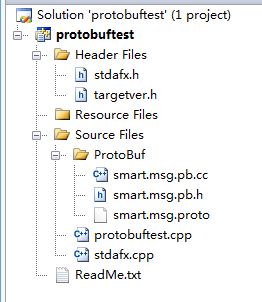

配置项目属性C/C++ ----> General --->  Additional Include Directories  ..\Include\src  

Linker--->General ----> Additional Library Directories  ..\Lib
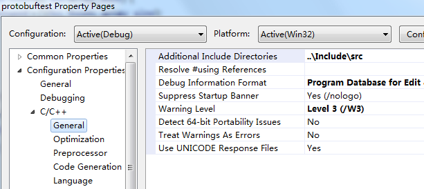
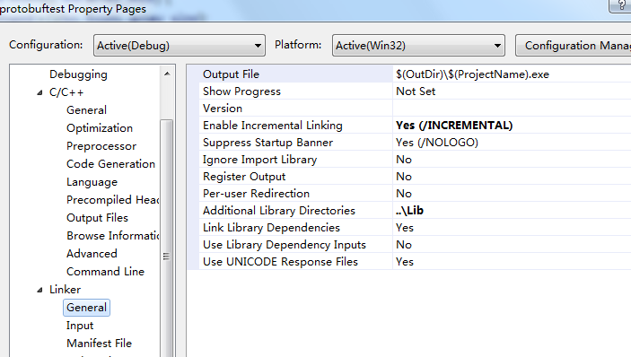

顺便把预编译也关了
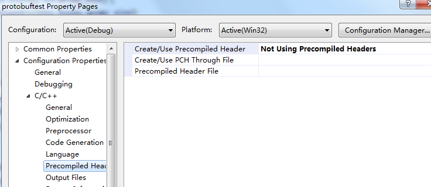
9. 项目配置好后写代码：
``` cpp
#include "stdafx.h"
#include <iostream>
#include <fstream>
#include "../ProtoBuf/smart.msg.pb.h"
#pragma comment(lib, "libprotobuf.lib")  
#pragma comment(lib, "libprotoc.lib")

int _tmain(int argc, _TCHAR* argv[])
{
    smart::test msg1; 
    msg1.set_age(101); 
    msg1.set_name("nice to meet you!");
    std::fstream out("User.pb", std::ios::out | std::ios::binary | std::ios::trunc);  
    msg1.SerializeToOstream(&out);  
    out.close(); 

    smart::test msg2;  
    std::fstream in("User.pb", std::ios::in | std::ios::binary);  
    if (!msg2.ParseFromIstream(&in)) {  
        std::cerr << "Failed to parse User.pb." << std::endl;  
        exit(1);  
    }  

    std::cout << msg2.age() << std::endl;  
    std::cout << msg2.name() << std::endl; 
    std::cout << msg2.email() << std::endl;
    std::cout << "adfdf" <<std::endl;


    getchar();
    return 0;
}
```
测试输出 
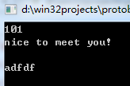
到此为止windows环境配置和使用google protocol buffer已经解决。  
## Linux环境配置和使用：
1. 解压编译配置，敲命令就可以了：
``` cpp
unzip protobuf-2.6.1 
cd protobuf-2.6.1
 ./configure --prefix=/usr/local/protobuf-2.6.1
 make 
 make check 
 make install
```
2. 写proto文件和编译，跟上面的相同：
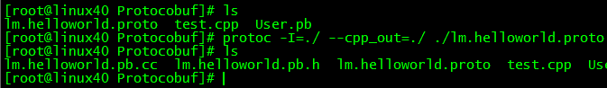
3. 连带.cc文件一同编译，生成目标并执行，以后会写成makefile，这只是个测试程序，就简单测试下  
记得编译时带上-lpthread 和-lprotobuf
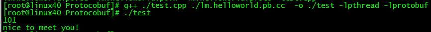
 如果运行时提示找不到libprotobuf9.so这个库，可以敲这个命令  
 export LD_LIBRARY_PATH=$LD_LIBRARY_PATH:/usr/local/lib
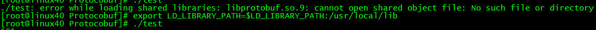
到此为止就完成了google protobuf的 学习和配置
