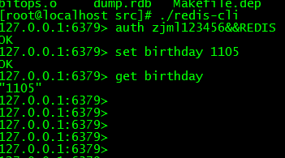

## 一、Redis简介：

`Redis`为`非关系型数据库`，Redis是一个`Key-Value`存储系统。它支持存储的value类型有：`string(字符串)`,`list(链表)`, `set(无序集合)`,`zset(sorted set有序集合)`和`hash`，Redis支持各种不同方式的排序。数据都是`缓存`在`内存`中的，它也可以周期性的把更新的数据写入磁盘或者把修改操作写入追加的记录文件，并实现了`master-slave(主从)同步`。

## 二、Redis安装和使用：

Redis下载地址，我下载的为最新版本：

wget [http://download.redis.io/releases/redis-3.2.8.tar.gz](wget http://download.redis.io/releases/redis-3.2.8.tar.gz)  

解压安装：

``` bash
$ tar xzf redis-3.2.8.tar.gz
$ cd redis-3.2.8
$ make
```
make完后 redis-3.2.8目录下会出现redis-server和redis-cli
下面在src目录下启动redis服务.
``` bash
$./redis-server
```
<!--more-->
注意这种方式启动redis 使用的是默认配置。也可以通过启动参数告诉redis使用指定配置文件使用下面命令启动.
``` bash
$ ./redis-server redis.conf
```
redis.conf是一个默认的配置文件。我们可以根据需要使用自己的配置文件。
启动redis服务进程后，就可以使用测试客户端程序redis-cli和redis服务交互了.
下面为官方提供的案例：
服务器启动：
``` bash
src/redis-server redis.conf
```
客户端读写：

``` bash
$ src/redis-cli
redis> set foo bar
OK
redis> get foo
"bar"

```
redis.conf 为redis配置文件，有很多参数供用户修改，这里仅仅说明几个参数，其他的读者自行搜索。

port: 为redis启动的端口号，当需要启动多个redis服务器时修改该参数，可以启动多个服务。

bind ：绑定ip，设置后只接受自该ip的请求

databases ：设置数据库的个数，默认使用的数据库为0，redis有16个数据库，修改参数可写入不同的数据库。

requirepass ：设置登录时需要使用的密码。

下面修改requirepass  为 zjml123456&&REDIS,那么重启redis-server,放在后台运行。效果就是这样

然后启动客户端使用密码登录并且查询数据

使用密码命令为：auth 密码

设置key和value的命令为: set key value

取出key对应的value 为： get key

## 使用C++访问redis:
使用redis接口之前需要将hireids.h 和libhiredis.a放到项目目录里，这两个文件在redis解压目录redis-3.2.8/deps/下,我这里写了一个demo，所以都放在demo的文件夹下了。

下面介绍redis提供的供C++访问的接口

 主要包括如下四个方法

1. redisContext* redisConnect(const char *ip, int port)

该函数用来连接redis数据库， 两个参数分别是redis数据库的ip和端口，端口号一般为6379。

2. void *redisCommand(redisContext *c, const char *format...)

该函数用于执行redis数据库中的命令，第一个参数为连接数据库返回的redisContext，剩下的参数为变参，如同C语言中的prinf()函数。此函数的返回值为void*，但是一般会强制转换为redisReply类型，以便做进一步的处理。根据redisReply中的type变量类型判断命令执行情况

REDIS_REPLY_STATUS：

返回执行结果为状态的命令。比如set命令的返回值的类型是REDIS_REPLY_STATUS，然后只有当返回信息是"OK"时，才表示该命令执行成功。

可以通过reply->str得到文字信息，通过reply->len得到信息长度。

REDIS_REPLY_ERROR：

返回错误。错误信息可以通过reply->str得到文字信息，通过reply->len得到信息长度。

REDIS_REPLY_INTEGER：

返回整型标识。可以通过reply->integer变量得到类型为long long的值。

REDIS_REPLY_NIL:

返回nil对象，说明不存在要访问的数据。

REDIS_REPLY_STRING:

返回字符串标识。可以通过reply->str得到具体值，通过reply->len得到信息长度。

REDIS_REPLY_ARRAY:

返回数据集标识。数据集中元素的数目可以通过reply->elements获得，每个元素是个redisReply对象，

元素值可以通过reply->element[..index..].*形式获得，用在获取多个数据结果的操作。

3. void freeReplyObject(void *reply)

释放redisCommand执行后返回的的redisReply所占用的内存。

4. void redisFree(redisContext *c)

释放redisConnect()所产生的连接。

下面是我封装的一个C++访问redis的类

RedisManager.h

``` cpp
class RedisManager 
    {
       public:

        RedisManager();
        virtual ~RedisManager();
        //初始化函数
        bool initial();
        //释放函数
        void release();
        //封装的set接口
        void set(std::string key, std::string value);
        //封装的get接口
        std::string get(std::string key);
        
        private:
        
        //连接的缓存指针
        redisContext* m_pConnect;
        //请求处理结果指针
        redisReply* m_pReply;
    };
```
RedisManager.cpp

分别介绍几个接口：

构造函数和析构函数没写代码，下面是初始化函数：

初始化函数：

``` cpp
bool RedisManager::initial()
{
    //redis服务器ip
    const char*  redisIp = "192.168.1.40";
    //redis服务器端口
    int  redisPort = 6379;
    //连接redis服务器
    m_pConnect = redisConnect(redisIp, redisPort);                    
    m_pReply = NULL;
    if(!m_pConnect)
    {
        return false;
    }
    if (m_pConnect != NULL && m_pConnect->err) {
        cout << " redis connect failed!!!!" << endl;
        return false;
    }
    //根据密码登录
    m_pReply =(redisReply*) redisCommand(m_pConnect, "AUTH %s", mypass.c_str()); 
    if(!m_pReply)
    {
        cout << "redis exe failed!!"<<endl;
        return false;    
    }
    
    if( !(m_pReply->type == REDIS_REPLY_STATUS && strcasecmp(m_pReply->str,"OK")==0))  
    { 
        cout << " redis auth failed!!!!" << endl;
        freeReplyObject(m_pReply );
        m_pReply = NULL;
        return false;
    }
    
    freeReplyObject(this->m_pReply );
    m_pReply = NULL;
    
    cout << " redis auth success!!!!" << endl;
    return true;
}
```
释放函数：
``` cpp
void RedisManager::release()
{
    //释放连接
     freeReplyObject(m_pConnect);
     m_pConnect = NULL;
    m_pReply = NULL;
}
```
set函数：

``` cpp
void RedisManager::set(std::string key, std::string value)
{
    //设置key和value关系，插入redis
    redisReply* r =(redisReply*)redisCommand(this->m_pConnect, "SET %s %s", key.c_str(), value.c_str());   
    if(!r)
    {
        cout << "set redis faliled" << endl;
        return;
    }
        
    //执行失败
    if( !(r->type == REDIS_REPLY_STATUS && strcasecmp(r->str,"OK")==0))  
    {
        cout << "set redis faliled" << endl;
        freeReplyObject(r );
        return;    
    }
    
    cout << "set redis success"<<endl;
    freeReplyObject(r );
}
``` 
get函数：

``` cpp
std::string RedisManager::get(std::string key)
{
    //根据key获取value
    m_pReply = (redisReply*)redisCommand(this->m_pConnect, "GET %s", key.c_str());
    if(!m_pReply)
    {
        cout << "get value failed" << endl;
        return "";
    }
     //get成功返回结果为 REDIS_REPLY_STRING 
    if( m_pReply->type != REDIS_REPLY_STRING )  
    {
        cout << "get redis faliled" << endl;
        freeReplyObject(m_pReply );
        m_pReply = NULL;
        return "";    
    }
    cout << "get redis success"<<endl;
    std::string valuestr = m_pReply->str;
    freeReplyObject(m_pReply );
    m_pReply = NULL;
     
    return valuestr ;
}
```
main 函数为：
``` cpp
int main()
{
    RedisManager * redisManager = new RedisManager();   
    if(redisManager)
    {
        redisManager->initial();
    
        edisManager->set("test","nice to meet u!");
    
        std::string valueStr = redisManager->get("1sdfd");
        
        cout << valueStr << endl;
        
        redisManager->release();    
        delete redisManager;        
    }
        
}
```
源码下载地址：

[http://download.csdn.net/detail/secondtonone1/9826761](http://download.csdn.net/detail/secondtonone1/9826761)

