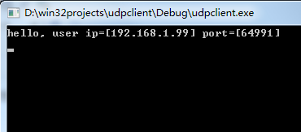
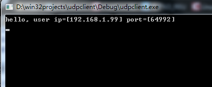

所谓`udp打洞`就是指客户端A通过`udp协议`向服务器发送数据包，服务器收到后，获取数据包，并且可获取客户端A`地址和端口号`。同样在客户端B发送给服务器udp数据包后，服务器同样在收到B发送过来的数据包后获取B的地址和端口号，将A和B的地址与端口号分别发送给对方，这样双方可以继续用UDP协议通信。这么做有什么用呢？因为对于一些应用或者需求，需要两个客户端临时做一些通信，而这种通信不需要建立tcp就可以完成，所以才去udp打洞。

下面附上测试代码：

头文件

``` cpp
// udphole.cpp : 定义控制台应用程序的入口点。

#ifdef WIN32
#include "stdafx.h"
#include <winsock2.h>
#include <stdio.h>
#pragma comment(lib, "Ws2_32.lib")
typedef SOCKET socketfd;
typedef SOCKADDR_IN sockaddr_in;
#endif

#ifdef __linux__

 #include <sys/types.h>
 #include <sys/socket.h>
 #include <netinet/in.h>
 #include <time.h>
 #include <string.h>
 #include <stdio.h>
 #include <unistd.h>
 #include <stdlib.h>
 #include <pthread.h>
 #include <iostream>
 #include <errno.h>
 #include <arpa/inet.h>
 #include <pthread.h>

typedef int socketfd;
#endif
#include <list>
#include <map>
#include <iostream>
using namespace std;
```
<!--more-->

服务器端核心代码。

``` cpp
#include <list>
#include <map>
#include <iostream>
using namespace std;

int main(int argc, char* argv[])
{
    #ifdef WIN32
    std::list<SOCKADDR_IN> addrList;

    WSADATA    wsaData = {0};
    if (0 != WSAStartup(MAKEWORD(2,2), &wsaData))
    {
        printf ("WSAStartup failed. errno=[%d]\n", WSAGetLastError());
        return    -1;
    }
    #endif

    #ifdef __linux__
    std::list<sockaddr_in> addrList;
    
    #endif

    //addrList 是地址列表，每次存放最新到来的。
    socketfd sockServer = socket(AF_INET, SOCK_DGRAM, IPPROTO_UDP);
    if (-1 == sockServer)
    {

        #ifdef WIN32
        printf ("socket server failed. errno=[%d]\n", WSAGetLastError());
        #endif

        #ifdef __linx__
        printf("socket server failed. errno=[%d]\n", errno);
        #endif    
    
        return    -2;
    }


    sockaddr_in    addrServer = {0};
    
    addrServer.sin_family    = AF_INET;
    addrServer.sin_addr.s_addr = INADDR_ANY;//inet_addr("192.168.1.2");
    addrServer.sin_port = htons(10000);
    if (0 != bind(sockServer, (sockaddr*)&addrServer, sizeof(addrServer)))
    {
        #ifdef WIN32
        printf ("bind server failed.errno=[%d]\n", WSAGetLastError());
        #endif

        #ifdef __linux__
        printf("bind server failed.errno=[%d]\n", errno);
        #endif        

        return    -3;
    }

    cout << "okok6"<<endl;
    while(1)
    {
        char    pcContent1[10240] = {0};
        sockaddr_in    addrUser1 = {0};
        #ifdef WIN32
        int    nLen1 = sizeof(addrUser1);
        #endif

        #ifdef __linux__
        socklen_t nLen1 = sizeof(addrUser1);
        #endif
        //服务器接收来自客户端的消息，并且用addrUser1保存地址和端口
        if (-1 == recvfrom(sockServer, pcContent1, sizeof(pcContent1), 0, (sockaddr*)&addrUser1, &nLen1))
        {
            cout << "dfdfda"<<endl;

            #ifdef WIN32
            printf ("recv user 1 failed.errno=[%d]", WSAGetLastError());
            #endif

            #ifdef __linux__
            printf ("recv user 1 failed.errno=[%d]", errno);
            #endif            

            return    -4;
        }
        else 
        {
            
            //
            printf ("connect user ip=[%s] port=[%d]\n", inet_ntoa(addrUser1.sin_addr), htons(addrUser1.sin_port));
           //如果地址列表非空，那么取出列表中的地址，并且与最新到来的客户端通信
            if(addrList.size())
            {
                sockaddr_in peerAddr = addrList.front();
                int nLen2 = sizeof(peerAddr);
                printf ("peer user ip=[%s] port=[%d]\n", inet_ntoa(peerAddr.sin_addr), htons(peerAddr.sin_port));

                if (-1 == sendto(sockServer, (char*)&addrUser1, nLen1, 0, (sockaddr*)&peerAddr, nLen2))
                {
                    #ifdef WIN32
                     printf ("send to peer user  data failed.\n", WSAGetLastError());
                    #endif

                    #ifdef __linux__
                     printf ("send to peer user  data failed.\n", errno);
                    #endif
                    return    -6;
                }

                if (-1 == sendto(sockServer, (char*)&peerAddr, nLen2, 0, (sockaddr*)&addrUser1, nLen1))
                {
                    #ifdef WIN32
                    printf ("send to connect user  data failed.\n", WSAGetLastError());
                    #endif

                    #ifdef __linux__
                     printf ("send to connect user  data failed.\n", errno);
                    #endif
                    return    -6;
                }

                addrList.pop_front();
            }
            else
            {
                //如果列表为空，那么将该地址放入列表中。
                addrList.push_back(addrUser1);
            }
        }
    }

    #ifdef WIN32
    Sleep(INFINITE);
    #endif

    #ifdef __linux__
    //sleep(1000);
    #endif
    return 0;
}
```
 

下面是客户端发送消息的代码，比较简单。

``` cpp
#include "stdafx.h"


#include <winsock2.h>
#include <stdio.h>
#pragma comment(lib, "Ws2_32.lib")


int _tmain(int argc, _TCHAR* argv[])
{
    WSADATA    wsaData = {0};
    if (0 != WSAStartup(MAKEWORD(2,2), &wsaData))
    {
        printf ("WSAStartup failed. errno=[%d]\n", WSAGetLastError());
        return    -1;
    }
    SOCKET    sockClient = socket(AF_INET, SOCK_DGRAM, IPPROTO_UDP);
    if (SOCKET_ERROR == sockClient)
    {
        printf ("socket server failed. errno=[%d]\n", WSAGetLastError());
        return    -2;
    }
    char    pcContent1[UCHAR_MAX] = {0};
    SOCKADDR_IN    addrServer = {0};
    addrServer.sin_family    = AF_INET;
    addrServer.sin_addr.s_addr    = inet_addr("192.168.1.40");
    addrServer.sin_port    = htons(10000);
    int    nLen1 = sizeof(addrServer);
    //客户端发送自己的报文
    if (SOCKET_ERROR == sendto(sockClient, pcContent1, 1, 0, (sockaddr*)&addrServer, nLen1))
    {
        printf ("recv user 1 failed.errno=[%d]", WSAGetLastError());
        return    -3;
    }
    SOCKADDR_IN    addrUser = {0};
    char    pcContent2[UCHAR_MAX] = {0};
    //阻塞接收来自服务器的消息。
    if (SOCKET_ERROR == recvfrom(sockClient, pcContent2, sizeof(pcContent2), 0, (sockaddr*)&addrServer, &nLen1))
    {
        printf ("recv user 1 failed.errno=[%d]", WSAGetLastError());
        return    -5;
    }
    else 
    {
        memcpy (&addrUser, pcContent2, sizeof(addrUser));
        sprintf (pcContent2, "hello, user ip=[%s] port=[%d]\n", inet_ntoa(addrUser.sin_addr), htons(addrUser.sin_port));
        //解析服务器消息后发送消息给另一个客户端。
        if (SOCKET_ERROR == sendto(sockClient, pcContent2, strlen(pcContent2), 0, (sockaddr*)&addrUser, nLen1))
        {
            printf ("recv user 1 failed.errno=[%d]", WSAGetLastError());
            return    -3;
        }
        else 
        {
            //阻塞接收另一个客户端发送过来的消息
            if (SOCKET_ERROR == recvfrom(sockClient, pcContent2, sizeof(pcContent2), 0, (sockaddr*)&addrServer, &nLen1))
            {
                printf ("recv user 1 failed.errno=[%d]", WSAGetLastError());
                return    -5;
            }
            printf ("%s", pcContent2);
        }
    }
    Sleep(INFINITE);
    return    0;

}
```
效果如下，服务器收到来自客户端A和客户端B的报文后打印他们的信息，并且互相转发消息。

客户端A和客户端B分别打印对方的地址和端口号


到此为止，udp打洞的代码介绍完了。可以关注我的公众号，谢谢
