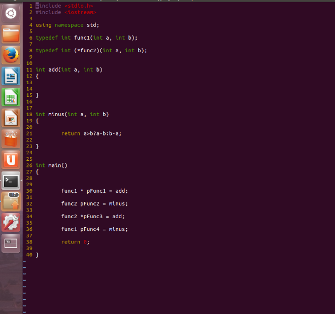
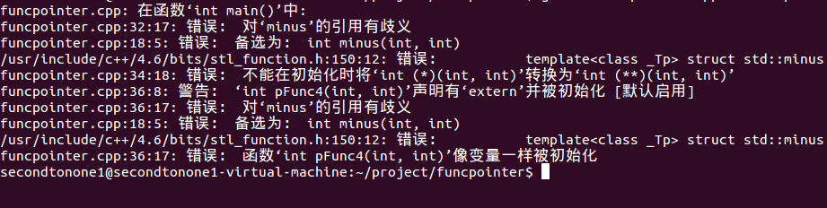
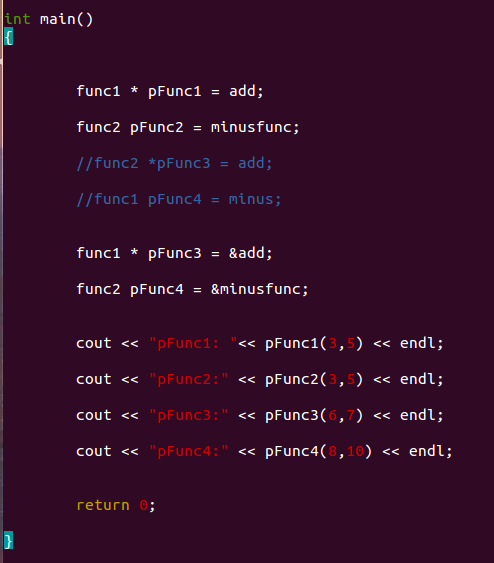

想着把每一个基础的知识点搞清，趁着早晨凉快就先写一些总结
函数指针，基本结构是 `函数返回类型（* 函数指针名字）（函数参数1，函数参数2，...）`；
这种指针用于`指向一个函数的地址`，可以`通过函数指针回调同类型的不同函数`，实现类似于`事件回调机制`的功能。
先写一个简单的测试程序

<!--more-->
编译后看看有什么结果

pFunc1和pFunc2是没问题的，pFunc3 提示两个函数指针类型不匹配，因为pFunc3是 int（**）(int , int);
pFunc4 其实是一个函数类型的对象，不予许赋值的。
所以进行如下更改，并写出测试代码

对于函数指针赋值的时候，可以直接用函数名字，也可以进行&函数名赋值，
综上所述，可以先定义一个函数类型
typedef 函数返回类型 函数名 （函数形参1， 函数形参2，...）;
之后用 函数名 * 函数指针;
也可以 typedef 函数返回类型 (*函数指针类型名) （函数形参1，函数形参2,...）；
之后用 函数指针类型名   函数指针；

 
